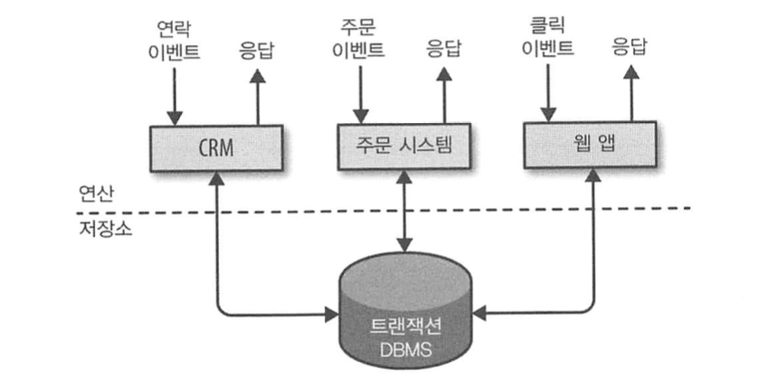
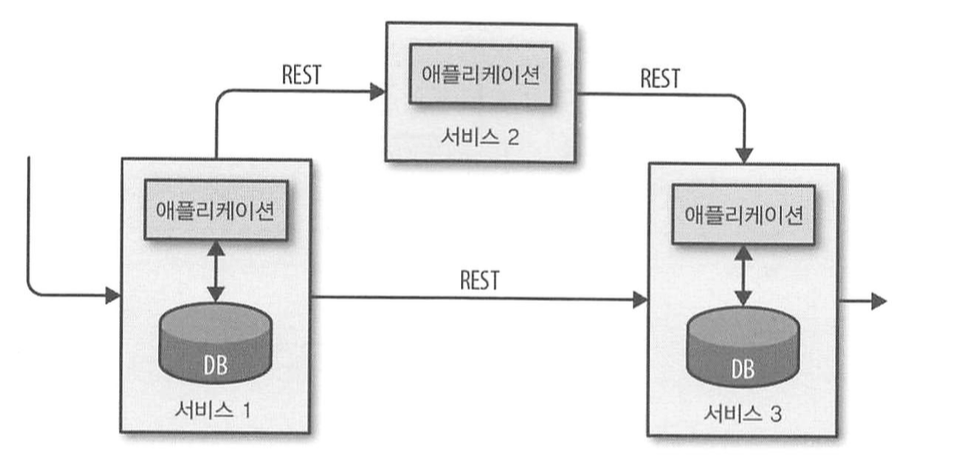
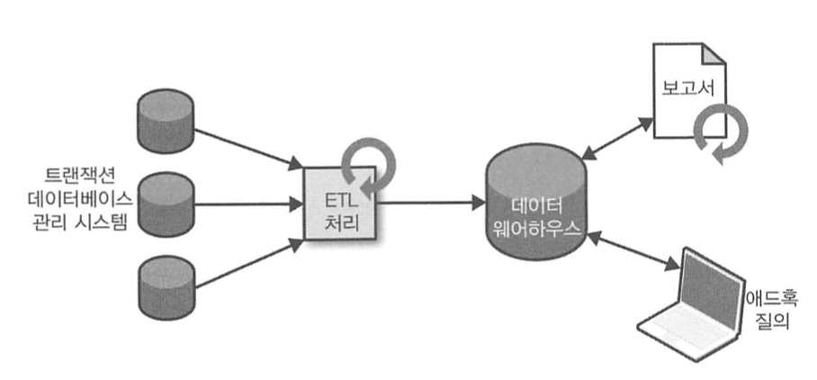
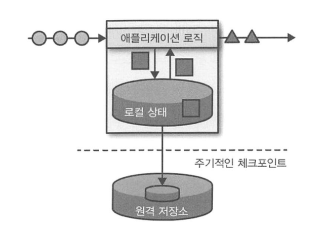
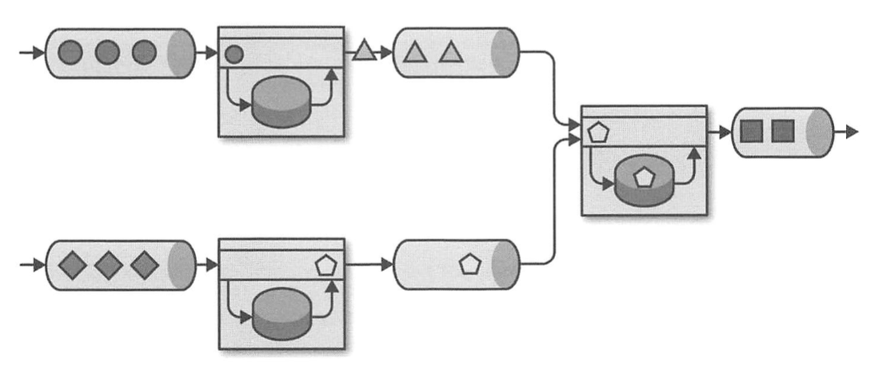
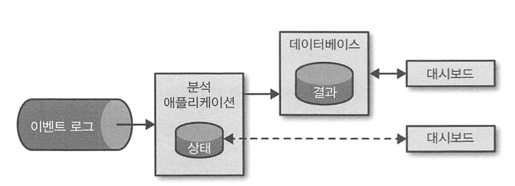

# 상태가 있는 스트림 처리 소개

> 아파치 플링크 : 분산 스트림 처리 소프트웨어.   상태가 있는 스트림 처리 어플리케이션 구현에 필요한 API를 제공하며, 대규모 환경에서 상태가 있는 스트림 처리 어플리케이션의 장애 회복 기능을 제공한다.

## 전통적인 데이터 인프라

전통적인 데이터 처리 아키텍처는 **트랜잭션 처리**와 **분석 처리**의 두 종류의 데이터 처리로 분류할 수 있다. 

### 트랜잭션 처리

- 어플리케이션은 외부 서비스 혹은 사용자와 상호작용하면서 다양한 이벤트를 지속적으로 처리한다. 이 과정에서 원격 DBMS에 트랜잭션을 걸어 데이터를 읽거나 갱신한다.
  - 이때, 다수의 app이 동일한 데이터 모델을 대상으로 작업하거나, 동일한 인프라를 공유한다. 
  - 따라서 app 개선이나 규모 확장 시, 문제가 발생하기 쉽다.

- 마이크로서비스 설계 패턴을 이용해 app 사이의 강결합을 해소하고, 독립적으로 시스템을 운영할 수 있다.
  - 마이크로서비스는 잘 정의한 인터페이스를 통해 서로 통신하게 강제하므로, 서비스 간 결합을 완전히 분리할 수 있다.
  - 따라서 각 서비스를 서로 다른 기술 스택(데이터 저장소 포함)으로 구현할 수 있다.

    
### 분석 처리

- 트랜잭션 데이터베이스 시스템의 데이터를 분석해, 비즈니스적으로 가치 있는 통찰력을 얻을 수 있다.
  - 하지만 MSA 환경에서 데이터 대부분이 서로 다른 DBMS에 분산돼 있으므로, 이를 통합 분석할 필요가 있다. 

- 분석 작업은 데이터 웨어하우스 (분석 질의 전용 데이터 저장소)에 데이터를 복제한 후 실행한다.
  - ETL : 데이터 웨어하우스로 데이터를 복제하는 처리 (추출-변환-적재) 데이터 웨어하우스와 데이터를 동기화하기 위해 주기적으로 실행되어야 한다.
- ETL 이후 데이터 웨어하우스에서 데이터에 질의나 분석을 실행할 수 있다. 질의는 두 가지로 분류할 수 있으며, 데이터 웨어하우스는 두 질의를 배치 처리로 실행한다.
  1) 비즈니스와 관련 있는 데이터를 주기적으로 보고하는 질의. (기업 수익, 고객 유입 증가, 제품 출하량 등)
  2) 애드혹 (Ad-Hoc) 질의 : 특정 문의에 응답하거나, 비즈니스 관련 민첩한 결정이 필요할 때 쓰는 질의. (마케팅 효율 평가를 위한 광고 지출 및 수입 등)

위 작업을 처리하기 위해 모든 데이터를 RDB에 넣기보단, 하둡 분산 파일 시스템(HDFS)나 S3, 아파치 HBase와 같은 벌크 저장소에 저장하는 것이 일반적이다. 
하지만, 이후 SQL-on-Hadoop 엔진을 이용해 데이터를 질의하고 처리한다는 점에서 전통적인 데이터 웨어하우스 아키텍처와 근본적으로 동일하다.

## 상태가 있는 스트림 처리

- 모든 데이터는 이벤트 스트림이 지속적으로 생성한 데이터라고 가정할 수 있다.
- 하지만 모든 데이터가 한 번에 생성되는 유한하고 완전한 데이터셋을 찾긴 어려우므로, 무한 이벤트 스트림 처리 설계 패턴인 상태가 있는 스트림 처리를 응용할 수 있다. 

> 상태가 있는 스트림 처리의 동작 방식  
> : 상태가 있는 어플리케이션은 이벤트를 수신한 후, 상태에서 데이터를 읽거나 상태에 데이터를 쓴다. 

- 아파치 플링크는 어플리케이션 상태를 로컬 메모리 or 임베디드 데이터베이스에 저장한다.
  - 플링크는 분산 시스템이므로, 로컬에 저장한 상태가 유실되지 않도록 원격의 신뢰성 있는 저장소에 어플리케이션 상태 체크포인트를 주기적으로 기록한다. 
- 상태가 있는 스트림 처리 어플리케이션은 주로 이벤트 로그에서 이벤트를 가져온다.
  - 이벤트 로그 시스템 : 이벤트 스트림을 저장하고 분배한다. 생산자 (producer)는 추가 전용 로그에 이벤트를 쓰며, 이는 소비자 (consumer)가 이벤트를 읽을 때 순서가 변하지 않으며 (결정적) 동일 이벤트를 여러 번 읽을 수 있음을 의미한다.
- 플링크로 실행하는 상태가 있는 스트리밍 어플리케이션 + 이벤트 로그 시스템
  1) 이벤트 로그가 들어오는 이벤트를 저장하고, 같은 순서로 app에 전송
  2) 장애 발생 시, 플링크는 직전 체크포인트에서 어플리케이션 상태를 복구하고, 이벤트 로그의 읽기 위치를 이전 위치로 재설정해 app 상태를 원복한다. 
  3) app은 이벤트 스트림의 끝까지 이벤트 로그를 재생한다.
  - 장애 복구 뿐 아니라, app 상태 갱신, 버그 수정, A/B 테스트, 마이그레이션 등등에서 응용 가능하다.

상태가 있는 스트림 처리를 이용해 구현하는 어플리케이션은 일반적으로 세 종류가 있다.
- 이벤트 주도 어플리케이션
- 데이터 파이프라인 어플리케이션
- 데이터 분석 어플리케이션

> 실제로는 위의 세 패턴을 한 종류 이상 섞어서 어플리케이션을 구현할 수 있다.

### 이벤트 주도 애플리케이션 (Event-Driven Application)

> 이벤트 스트림을 입력으로 받아 특정 비즈니스 로직을 처리하는 상태가 있는 스트리밍 어플리케이션.

- 비즈니스 로직에 따라 기능을 수행하거나, 다른 EDA가 소비할 수 있도록 외부 이벤트 스트림으로 이벤트를 내보낸다.
- 대표적인 유스케이스
  - 실시간 추천
  - 패턴 감지 or 복합 이벤트 처리 (CEP) : 신용카드의 부정 사용 감지 등
  - 이상 탐지 : 컴퓨터 네트워크 침입 시도 감지 등

- REST 호출 대신 이벤트 로그를 통해 서로 통신한다.
  - 한 어플리케이션이 이벤트 로그에 결과 출력 -> 다른 어플리케이션이 소비하는 방식.
  - 이벤트 로그는 이벤트 전송과 수신을 분리하고, 비동기 논블록킹으로 이벤트를 전송한다.
  - 입력 데이터를 안정적으로 저장하고, 이벤트 순서를 보장하므로 이벤트를 여러 번 처리할 수 있다.
- 어플리케이션 상태는 로컬에서 관리한다.
  - 따라서 어플리케이션 동작과 수평 확장을 각 어플리케이션이 독립적으로 수행할 수 있고, 원격 DBMS를 쓰는 것보다 훨씬 빠르다.
- 플링크를 이용해 어플리케이션 상태를 이전 세이브포인트로 설정하면, 상태를 잃지 않고 어플리케이션을 업그레이드 or 수평 확장 할 수 있다.

> EDA를 실행하기 위해, 스트림 처리기의 기능이 중요하다 (API 표현력, 상태 관리 품질, 이벤트 시간 지원 등)  
> 또한, 정확히 한 번 수준의 상태 일관성과 어플리케이션 수평 확장이 기본적으로 요구된다.

### 데이터 파이프라인

> 짧은 지연으로 데이터를 가져와 변환, 삽입하는 패턴

- 하나의 IT 아키텍처에는 RDB, 이벤트 로그, 인메모리 캐시 등 다양한 특수 목적의 데이터 베이스가 존재한다. 이때 데이터 접근 성능 향상의 목적으로, 동일 데이터를 여러 DB에 저장할 수 있다.
- 이와 같은 데이터 복제 필요성에 의해, 데이터 동기화가 필요하다. ETL을 활용할 수 있으나, 지연 시간이 길다는 문제가 있다.
  - 이때 이벤트 로그를 활용해, 데이터 변경 내용을 분산하는 방법이 있다.
  - 이벤트 로그에 변경 내용 도착 -> 이벤트 로그가 분산 -> 목적지로 데이터가 도착하기 전에 데이터 정규화 or 데이터 보강 or 집계 연산 가능

> 데이터 파이프라인은 짧은 시간에 많은 양의 데이터를 처리할 수 있어야 한다.  
> 동시에, 데이터 파이프라인 스트림 처리기는 여러 데이터 시스템에서 데이터를 읽고 쓸 수 있는 많은 소스와 씽크 커넥터를 제공해야 한다.

### 스트리밍 분석

- 분석 ETL 작업은 아키텍처에 관계없이 모두 배치로 처리된다. 이로 인해 분석 파이프라인에 긴 지연 시간이 발생한다.
- 스트리밍 분석 어플리케이션을 통해, 지속적으로 이벤트 스트림을 가져와 짧은 지연 시간으로 최신 이벤트를 처리하고 결과를 갱신할 수 있다.
  - DBMS가 M-View를 갱신할 때 사용하는 방식과 유사하다.
- 또한 여러 개별 컴포넌트가 필요한 전통적인 분석 파이프라인과 달리, 상태가 있는 스트리밍 어플리케이션을 실행하는 스트림 처리기 하나로 모든 절차를 관리할 수 있다.
  - 이 과정에서 일관성이 보장되는 상태를 활용해 장애 복구 및 자원 조절이 가능하다.
- 대표적인 유스케이스
  - 휴대전화 네트워크의 품질 모니터링
  - 모바일 어플리케이션 사용자의 핸동 분석
  - 가전제품 라이브 데이터 애드혹 분석

## 오픈소스 스트리밍 처리의 진화

오픈소스 SW는 무료이며, 커뮤니티가 다함께 성장시킨다는 점에서 주도적 위치를 차지한다. 

### 스트림 처리의 역사

1. 람다 아키텍처
   - 밀리초 단위의 지연 시간으로 이벤트를 처리하는 것에 집중 & 장애 시 유실 허용하는 1세대의 대표 아키텍처
   - 주기적으로 배치 처리를 수행하는 전통 아키텍처에 스트림 처리 기반의 스피드 계층이 추가됨
   - 데이터 도착 -> (스트림 처리기는 근실시간으로 연산 수행 후 스피드 테이블에 저장 / 배치 처리기는 주기적으로 배치 저장소의 데이터를 처리하고 배치 테이블에 저장) -> 어플리케이션은 스피드 테이블의 대략적인 결과와 배치 테이블의 정확한 결과를 병합해 소비

2. 2세대
   - 이전보다 향상된 장애 복구 기능 지원
   - 실패해도 각 레코드에 결과가 한 번만 방영됨을 보장
   - 고수준 API로 진화
   - 여전히 시간과 이벤트 도착 순서에 따라 처리 결과 달라지는 이슈

3. 3세대 (플링크 포함)
   - 시간 & 이벤트 도착 순서에 따라 결과가 달라지는 이슈를 해결
   - 과거 데이터도 라이브 데이터와 같은 방식으로 처리 가능
   - 짧은 지연 시간과 높은 처리율 모두 제공

## 플링크 빠르게 살펴보기

아파치 플링크는 대규모 환경에서 높은 처리율과 짧은 지연으로 정확한 스트림 처리, 그리고 다양한 기능을 제공한다.

1. 이벤트 시간과 처리 시간 시멘틱 : 이벤트 시간 시멘틱은 순서가 바뀐 이벤트가 들어와도 일관성 있고 정확한 결과를 제공한다.
2. 상태 일관성 보장 : 초당 수백만 이벤트를 처리하면서 밀리초 단위의 지연 시간을 보장한다.
3. 표현력과 사용 편리성에 따라 선택 가능한 계층적 API : 윈도잉과 비동기 연산, 상태와 시간의 미세한 제어가 가능한 인터페이스 등 스트림 처리 연산에 필요한 다양한 기능 제공
4. 카프카, 카산드라, ELS, JDBC, 키네시스, HDFS, S3와 같은 저장 시스템에 연결하는 다양한 커넥터 지원
5. k8s 등과의 강력한 통합, 장애 복구, 동적 규모 확장이 가능한 고가용성 -> 짧은 다운타임으로 무중단 실행 가능
6. 상태를 잃어버리지 않고 다른 플링크 클러스터로 잡 코드 업그레이드 & 마이그레이션 제공
7. 사전 문제 인지 & 반응을 위해 메트릭 수집 제공
8. etc
