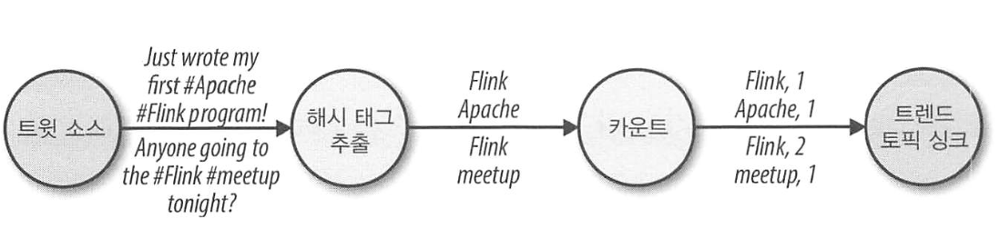
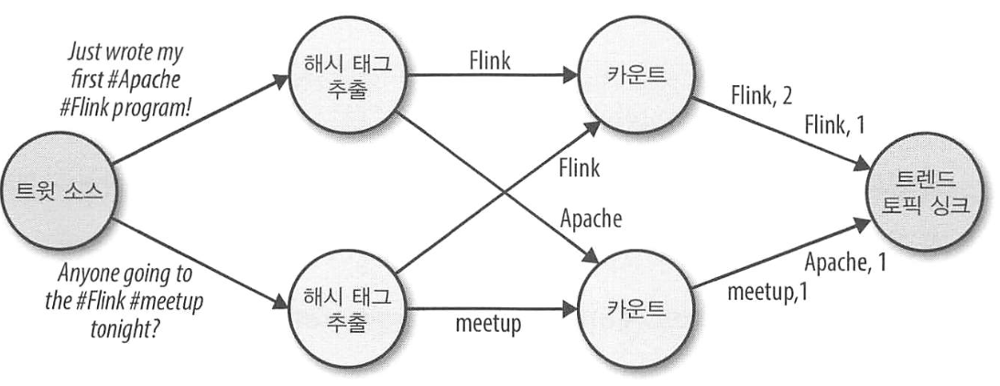

# 스트리밍 처리 기초

## 데이터플로우 프로그래밍 소개

### 데이터플로우 그래프

- 데이터플로우 프로그램 : 데이터 처리 연산 사이로 데이터가 어떻게 흐르는지를 기술한다.
- 방향성 그래프 : 데이터 플로우 프로그램을 표현하는 방법. 노드는 연산자라 부르고 계산을 표현하며, 엣지는 의존 관계를 표현한다.
  - 연산자는 어플리케이션의 기본 기능 단위로, 입력으로 들어온 데이터를 소비하고 계산을 수행한 후 출력으로 결과를 내보낸다.
  - 데이터 소스 : 입력이 없는 연산자
  - 싱크 : 출력이 없는 연산자
  - 데이터 플로우 그래프는 최소 하나의 소스와 싱크를 갖는다.

- 논리적 데이터플로우 그래프 : 개념적 수준에서 바라본 계산 로직의 모습

- 물리적 데이터플로우 : 데이터플로우 그래프를 실행하기 위해 논리적 그래프를 물리적 그래프로 변환해야 한다. 
  - 물리적 데이터플로우는 프로그램을 어떻게 실행해야 하는지를 자세하게 지정한다. 이때 노드는 태스크가 된다.
  - 위 예제는 '해시태그추출', '카운트' 두 개의 연산자를 가지며, 각각 두개의 병렬 연산 태스크를 갖는다. 각 태스크는 입력 데이터를 분할해 연산을 수행한다.

### 데이터 병렬화와 태스크 병렬화

- 데이터플로우 그래프 병렬화 방식
  - 데이터 병렬화 : 동일 연산을 수행하는 태스크를 각 입력 파티션에 할당해 병렬로 실행한다. 대용량 데이터 처리의 부하를 여러 장비로 분산시킬 수 있어 유용하다.
  - 태스크 병렬화 : 같거나 다른 데이터에 여러 연산을 수행하는 태스크를 할당한다. 클러스터 계산 자원을 더 효율적으로 사용할 수 있다.

### 데이터 교환 전략

- 물리적 데이터플로우 그래프에서 어떤 태스크로 레코드를 할당할지 정의하는 것

- 전진 전략 (forward)
  - 한 태스크로 들어온 데이터를 다른 태스크 쪽으로 보낸다.
  - 두 태스크가 동일한 물리적 장비에 할당될 경우, 네트워크 통신 없이 데이터를 교환할 수 있다.
- 브로드캐스트 전략 (broadcast)
  - 모든 레코드를 연산자의 모든 병렬 태스크로 내보낸다.
  - 데이터를 복제하고 네트워크 통신을 사용하므로 비싼 편.
- 키 기반 전략 (key based)
  - 데이터를 키 기준으로 모아 같은 키 값을 가진 데이터는 같은 태스크에 모이도록 보장한다.
- 랜덤 전략 (random)
  - 각 계산 태스크의 부하를 균등하게 분산시키고자 모든 연산자 태스크로 데이터를 균등하게 분배한다.

## 병렬 스트림 처리

> 데이터 스트림 : 무한 이벤트 순서열

### 지연과 처리율

- 배치 프로그램과 스트리밍 프로그램은 성능을 측정하는 방식이 다르다.
  - 배치 어플리케이션 : 잡의 총 실행 시간이나, 사용 중인 처리 엔진이 입력을 읽고 결과를 쓰는 데 얼마나 많은 시간을 소모하는가?
  - 스트리밍 어플리케이션 : 전체 실행 시간은 중요하지 않음 (어차피 지속적으로 이벤트 들어오니까). 
    - 지연(latency)와 처리율(throughput)을 이용해 얼마나 빠른 속도로 이벤트를 처리하고 계산 결과를 제공하는지가 중요

- 지연 : 이벤트를 처리하는 데 얼마나 많은 시간이 걸리는가?
  - 일반적으로 이벤트 수신과 이벤트 처리 결과(효과)를 출력에서 볼 때까지의 경과 시간
    - e.g., 카페에 입장한 순간부터 커피를 마시는 순간까지 보낸 시간
  - 데이터 스트리밍에서 지연은 밀리초와 같은 시간 단위로 측정된다. 
    - 평균 지연이 10ms = 이벤트를 처리하는 데 평균 10ms가 걸렸다.
    - 95번째 퍼센타일 지연 값이 10ms = 이벤트의 95%를 처리하는 데 10ms가 걸렸다는 것

- 처리율 : 단위 시간 당 얼마나 많은 이벤트를 처리할 수 있는가?
  - e.g., 카페가 7시에 문을 열고 하루에 600명의 손님을 받는다면, 평균 처리율은 시간당 50명
  - 처리율을 높게 잡고 싶다면 지연을 가능한 짧게 잡아야 한다.
  - 처리율은 단위 시간당 처리한 이벤트 개수, 혹은 연산 호출 횟수를 측정하므로, 이벤트 도착 비율에 의존한다.
  - 낮은 처리율이 꼭 나쁜 성능을 나타내지 않는다. 시스템이 최대 부하에 다다랐을 때 성능의 한계인 최대 처리율이 중요하다.
  - 배압 : 시스템이 처리할 수 있는 비율보다 높게 데이터를 계속 받아, 버퍼링도 불가능해져 데이터를 잃게 되는 상황

- 지연과 처리율
  - 둘은 독립적인 메트릭이 아니다.
  - 짧은 지연과 높은 처리율을 얻기 위해선, 1) 더 실력있는 바리스타의 고용 2) 더 많은 바리스타의 고용 두 가지 방법이 있다. 
  - 짧은 지연이 처리율을 높이므로, 시스템이 연산을 더 빠르게 더 많이 처리하게 하는 것이 중요하다.

### 데이터 스트림 연산

- 스트림 처리 엔진에서 제공하는 기본 연산을 조합해 데이터플로우 처리 그래프에서 스트리밍 어플리케이션 로직을 구현할 수 있다.
- 연산은 상태가 없거나 있을 수 있다.
  - 상태가 없을 경우 : 어떤 내부 상태도 유지하지 않으므로, 각 이벤트가 독립적이며 병렬화하기 쉽다. 장애가 발생해도, 단순히 마지막에 처리했던 지점부터 재시작하면 된다.
  - 상태가 있는 경우 : 이전에 받은 이벤트의 정보를 유지하며, 새로 들어온 이벤트가 상태를 갱신하고 이벤트 처리 로직에서 사용한다. 상태 분할과 장애 복구를 위한 병렬화, 내고장성이 어렵다.

- 데이터 인입과 방출 : 스트림 처리기가 외부 시스템과 통신하는 연산
  - 인입 (ingestion) : 외부 소스에서 원시 데이터를 가져와 스트림 처리에 맞는 형식으로 변환하는 연산
    - 데이터 소스 : 데이터를 가져오는 로직을 구현한 연산자
  - 방출 (egress) : 데이터를 수신할 외부 시스템의 소비 형태에 맞게 데이터 형식을 변환해 내보내는 연산
    - 데이터 싱크 : 데이터 방출을 수행하는 연산자. 

- 변환 연산 (transformation)
  - 단일 경로 연산으로, 각 이벤트를 독립적으로 처리한다.
  - 이벤트를 하나씩 소비하면서 각 이벤트 데이터에 변환 연산을 적용한 후 변환된 이벤트를 새 출력 스트림으로 내보낸다.
  - 이 변환 로직은 개발자가 사용자 정의 함수로 필요한 계산 로직을 구현한다.
  - 연산자는 여러 입력 스트림에서 이벤트를 받아 여러 출력 스트림을 생성할 수 있다.
    - 하나의 스트림 <-> 여러 스트림 등 데이터플로우 그래프의 구조를 변경할 수 있다.

- 롤링 집계 연산 (rolling aggregation)
  - 합계, 최솟값, 최댓값과 같은 집계 연산으로, 이벤트가 들어올 때마다 계속해서 상태를 갱신한다.
  - 집계 연산은 상태가 있으며, 새로 들어온 이벤트와 현재 상태를 결합해 집계 값을 계산한다.
  - 집계 연산은 결합 법칙과 교환 법칙이 성립해야하며, 그렇지 않은 경우 집계 연산자는 모든 이벤트 스트림 이력을 저장해야 한다.

- 윈도우 연산
  - 변환과 롤링 집계는 한 번에 한 이벤트만 처리한다. 
  - 반대로 결과 계산을 위해 일정량의 이벤트를 모아야 하는 경우 각 연산은 자신의 상태에 보관 가능한 수준으로 데이터 양을 제한해야 한다. 윈도우 연산자를 이용할 수 있다.
  - 윈도우 연산은 무한 이벤트 스트림에서 버킷이라 부르는 이벤트의 유한 집합을 지속적으로 생성하고, 이 유한 집합에 어떤 연산을 수행할 수 있게 해준다.
    - 보통 데이터 속성이나 시간을 기준으로 버킷에 이벤트를 할당한다.
  - 윈도우 연산의 시멘틱을 정확하게 정의하기 위해, 윈도우 정책으로 윈도우 동작을 정의한다.
    - 언제 새 버킷을 생성할 것인가?
    - 어떤 이벤트를 어떤 버킷에 할당할 것인가?
    - 언제 버킷의 내용을 평가할 것인가?
  - 윈도우 내용을 평가할 시점을 트리거 조건을 기반으로 결정한다.
    - 트리거 조건이 충족되면 버킷의 내용을 평가 함수로 전달해, 각 버킷 이벤트에 연산 로직을 적용한다.

- 텀블링 윈도우 : 고정 길이에 서로 겹치지 않는 버킷으로 이벤트를 할당한다. 이벤트가 윈도우 경계를 넘으면 처리하고자 버킷의 모든 이벤트를 평가 함수로 보낸다.
  - 개수 기반 : 윈도우가 트리거링되기 전에 얼마나 많은 이벤트를 모아야 하는지 정의
  - 시간 기반 : 이벤트를 어떤 버킷으로 버퍼링할지를 시간 간격으로 정의

- 슬라이딩 윈도우 : 서로 겹치는 고정 길이의 버킷으로 이벤트를 할당한다. 따라서 두 버킷에 포함되는 이벤트가 잇을 수 있다.
  - 길이와 슬라이드로 정의하며, 슬라이드 값은 새로운 버킷이 생성될 때까지의 간격을 정의한다.

- 세션 윈도우 : 텀블링이나 슬라이딩 윈도우로 적용할 수 없는 현실 세계 시나리오에 유용하다.
  - 세션 길이를 미리 정할 수 없고, 실제 데이터에 의존하는 경우 등에 해당한다
  - 세션이 종료됐다고 판단할 수 있는 비활동 시간을 세션 격차라는 값으로 정의해서 이벤트들을 세션으로 그룹화한다.

> 모든 윈도우가 스트림의 전체 이벤트를 대상으로 동작한다. 하지만 스트림을 여러 논리적 스트림으로 분할해서 병렬 윈도우로 정의하고 싶을 수 있다. 
  이때 병렬 윈도우의 각 파티션별로 다른 윈도우 정책을 적용할 수 있다.

- 윈도우 연산은 스트림 처리에서 시간과 상태 관리에 밀접한 관련을 갖는다. 
  - 현실 세계에서 스트림 데이터는 지연되거나 순서가 바뀔 수 있다. 
    - 이때 스트리밍 처리가 정확하고 결정적인 결과를 어떻개 생성하는지 이해해야 한다.
    - 이벤트 발생순으로 이벤트를 처리하는 경우, 이벤트 발생순으로 이력을 따라가며 이벤트를 처리해야 한다.

## 시간 시멘틱

### 스트리밍 처리에서 1분

유저 앨리스는 매일 아침 출근할 때 1분 동안 500개의 버블을 터뜨리는 온라인 게임을 플레이한다. 이때, 앨리스가 탑승한 지하철이 터널을 지나면서 1분동안 네트워크가 끊긴다. 터널을 지나 다시 네트워크가 연결되고, 게임은 버퍼링했던 이벤트를 분석 어플리케이션에 보낸다. 

어플리케이션은 앨리스가 오프라인일 때의 시간을 포함해야 할까? 아니면 버려야 할까?

이와 같이 시간이 중요한 게임에서, 1분 안의 이벤트 양을 정의하는 것은 처리 시간이 아닌, 데이터 자체의 실제 시간이다. 

따라서 스트림 어플리케이션은 처리 시간이나 이벤트 시간을 이용해 연산을 수행한다.

### 처리 시간

> 스트림 처리 연산자가 실행 중인 장비의 시계에서 측정한 로컬 시간

- 로컬 시간을 기준으로, 일정 시간 동안 윈도우 연산자에 도달한 모든 이벤트는 처리 시간 윈도우 안으로 들어간다.
- 이 경우, 앨리스의 네트워크가 끊어진 경우에도 처리 시간 윈도우 시간은 계속 흘러가므로, 터널에서 발생했던 게임 활동의 실제 시간을 반영하지 않는다.

### 이벤트 시간

> 이벤트가 실제 발생한 시간. 이벤트 내용 안에 포함된 타임스탬프를 기반으로 한다.

- 타임스탬프는 보통 스트리밍 처리 파이프라인에 도착하기 전에 생성되어, 이벤트 데이터 안에 존재한다.
  - 따라서 이벤트 시간 윈도우는 이벤트의 일부가 지연되더라도 발생했던 일들을 제대로 반영한다.
- 이벤트 시간은 처리 결과를 처리 속도와 완전히 분리하므로, 이벤트 시간 기반 연산은 예측할 수 있고 결과가 결정적이다.
  - 만약 데이터 순서가 바뀌어도 결과 정확성 보장 가능
  - 재생 가능한 스트림 로그와 결합한다면, 타임스탬프 결정성에 의해 과거 이벤트도 마치 실제 시간에 발생한 것처럼 분석할 수 있다.

### 워터 마크

> 워터마크 : 이벤트가 더 지연되지 않고 도착할 것이라고 확신할 수 있는 시점을 가리키는 메트릭. 전체 진행 시간을 나타낸다

- 워터마크는 스트리밍 시스템에 현재 이벤트 시간을 알려주는 논리적인 시계를 제공한다.
  - e.g., 연산자가 T 값의 워터마크를 받은 경우, 이 연산자는 T 보다 늦은 시간의 이벤트를 더 받지 않는다고 가정할 수 있다.
- 워터마크는 순서가 바뀐 이벤트를 처리하는 이벤트 시간 윈도우와 연산자 모두에게 필요하다
  - 연산자가 워터마크를 수신하면, 일정 기간 발생한 모든 이벤트의 시간이 감지됐다는 것을 알게 되고, 수신한 이벤트를 대상으로 계산을 시작하거나 이벤트를 정리한다.

워터마크는 결과의 신뢰성과 지연 사이의 균형을 맞출 수 있는 설정을 제공한다. 
- 워터마크가 너무 빠듯하게 발생되면? : 짧은 지연 보장, but 신뢰성 낮아짐
- 워터마크가 너무 느슨하게 발생되면? : 높은 신뢰성, but 불필요한 처리 지연 발생

> 실제 어플리케이션에서 시스템이 완벽하게 워터마크를 결정할 수 없으므로, 단순히 워터마크에 의존하면 안된다.  
> 스트림 시스템은 워터마크보다 늦게 도착한 이벤트를 처리할 몇 가지 방법을 제공한다.

### 처리 시간과 이벤트 시간

> 이벤트 시간으로 모든 문제를 해결할 수 있는데, 처리 시간이 왜 필요할까?

- 정확성보다 속도가 더 중요한 어플리케이션에서는 처리 시간이 더 유용하다.
  - 이벤트 순서를 고려하지 않아도 된다면, 윈도우는 단순히 이벤트를 버퍼링하고 지정한 윈도우에 이벤트가 도착하는 즉시 계산을 동작시킬 수 있다.
- 정확도가 중요하지 않은 실시간 보고서를 주기적으로 생성해야 하는 경우 처리 시간이 유용하다.
  - 이벤트가 도착하는 대로 집계해서 보여주는 실시간 모니터링 대시보드 어플리케이션 등
- 처리 시간 윈도우도 스트림 자체의 특성을 표현할 수 있으므로, 일부 유스케이스에서 필요할 수 있다.

> 처리 시간은 짧은 지연을 제공하지만 결과는 처리 속도에 따라 비결정적이다.  
> 이벤트 시간은 결정적 결과를 보장하고, 늦게 도착하거나 순서가 바뀐 이벤트를 처리해줄 수 있다.

## 상태와 일관성 모델

- 상태 : 데이터 처리 어디에나 존재하며, 거의 모든 계산에서 필수 값이다.
  - 함수는 일정 기간이나 일정 개수의 이벤트를 대상으로 상태를 누적해 결과를 생성한다.
  - 상태가 있는 연산자는 수신한 이벤트와 내부 상태를 사용해 연산 결과를 계산한다.

- 최신 스트림이 나오기 전, 배치 스트림으로 무한 데이터셋을 분석하는 경우
  - 배치 처리 시스템으로 들어오는 작은 배치를 대상으로 잡을 반복 스케줄링 한다.
  - 잡이 종료되면 결과를 영구 저장소에 전송하고, 외부 시스템에 상태 관리를 위임한다.
  - 다음 배치 처리에 스케줄돼 있는 잡은 이전 잡의 상태에 접근할 수 없다.

- 스트림에서 무한 데이터셋을 분석하는 경우
  - 모든 이벤트는 상태에 접근 가능하며, 이 상태를 프로그래밍 모델의 일급 시민으로 노출할 수 있다.
  - 추가 지연 시간이 발생할 순 있지만, 상태를 안전하게 관리하기 위해 외부 시스템을 사용할 수도 있다.
  - 스트림 연산자는 무한 데이터를 처리하므로 내부 상태가 무한으로 커지지 않도록 조심해야 한다. 보통 지금까지 받은 이벤트들을 요약 정보나 개요 같은 형태로 관리하여 상태 크기를 제한한다.

- 상태가 있는 연산자를 제공하기 위해 극복해야 하는 도전 과제들
  - 상태 관리 : 시스템은 상태 관리를 효율적으로 해야 하고, 동시에 상태를 갱신할 때 상태를 보호해야 한다.
  - 상태 분할 : 병렬로 처리할 때 처리 결과와 입력 이벤트 모두에 의존하므로 복잡해진다.
    - 보통 키로 상태를 분할할 수 있고, 각 파티션 별로 독립적으로 상태를 관리할 수 있다.
  - 상태 복구 : 상태를 복구하고 장애 시에도 정확한 결과를 내보내야 한다.

### 태스크 실패

태스크가 실패했을 때 어떻게 스트리밍 잡의 지속적인 실행을 보장할 수 있을까? 또, 결과와 연산자 상태의 정확성을 어떻게 보장할 수 있을까?

태스크는 입력 스트림의 각 이벤트를 대상으로 1) 이벤트를 수신해 로컬 버퍼에 저장 2) 경우에 따라 내부 상태 갱신 3) 출력 레코드 생산이라는 절차를 수행하는 하나의 처리 단계다. 
태스크 실패는 이 세 과정 어디에서든 발생할 수 있고, 시스템은 장애 시나리오마다 어떻게 동작할지를 명확하게 정의해야 한다. 

배치 잡은 처음부터 다시 시작할 수 있어 모든 실패에 대해 명확하지만, 스트리밍 세계에선 이벤트가 유실될 수 있고, 상태를 관리하기도 어렵다. 

따라서 최신 스트림 처리기는 태스크가 실패했을 때 몇 가지 결과 보장을 제공한다.

### 결과 보장

결과 보장의 관심사는 실패 복구 후 어플리케이션 코드가 바라보는 상태 값이다. 

어플리케이션 상태 일관성 보장은 출력의 일관성 보장과 같지 않다. 결과를 한 번 싱크로 보내면 싱크 시스템이 트랜잭션을 지원하지 않는 이상, 결과 정확성을 보장하기 어렵다.

- 최대 한 번 (At-most-once)
  - 태스크가 실패할 때 가장 간단한 상태 보장 방법은 유실된 상태와 이벤트 복구를 위해 아무것도 하지 않는 것이다.
  - 최대 한 번은 각 이벤트를 최대 한 번 처리하는 것을 보장한다. 즉, 이벤트는 날아가고, 결과 정확성 보장을 위해 하는 것이 아무것도 없다.
  - 모든 이벤트를 버리는 시스템조차도 제공하므로, '무보장' 이라고도 한다. 
  - 위험해 보여도, 대략적인 결과와 지연 시간 최소화에만 관심이 있다면 좋은 선택이다.

- 최소 한 번 (At-least-once)
  - 이벤트 유실을 원하지 않을 경우의 보장이다.
  - 모든 이벤트를 처리하지만, 그 중 일부는 한 번 이상 처리할 수도 있다. 결과의 완결만 중요하다면 중복 처리는 수용 가능한 조건이다.
  - 입력 스트림에서 특정 이벤트 발생 건수를 카운트할 경우, 최소 한 번 보장은 잘못된 결과를 반환할 수 있다.
  - 최소 한 번에서 결과 정확성을 보장하려면, 소스나 어떤 버퍼에서 이벤트를 재생할 방법이 필요하다.
    - 지속성 이벤트 로그는 모든 이벤트를 신뢰할 수 있는 저장소에 저장하므로, 태스크가 실패해도 이벤트를 재생할 수 있다.
    - 이 경우 파이프라인에 있는 태스크들이 이벤트를 모두 처리했다는 것을 이벤트 로그가 인식할 때까지, 모든 이벤트를 버퍼에 저장한다.
    - 이벤트 로그는 이벤트가 모두 처리됐다고 인식한 시점이 되었을 때 이벤트를 삭제한다.

- 정확히 한 번 (exactly-once)
  - 가장 엄격하고 구현이 쉽지 않다. 
  - 이벤트 유실이 없을 뿐 아니라, 이벤트마다 정확히 한 번씩만 내부 상태를 갱신한다는 것을 의미한다.
  - 마치 실패가 한 번도 없었던 것처럼 어플리케이션이 정확한 결과를 제공하리라는 것을 의미하며, 이를 제공하기 위해 최소 한 번 보장이 필요하다.
    - 따라서 데이터 재생 기능은 필수고, 스트림 처리기는 내부 상태 일관성을 보장해야 한다.
    - 장애 복구 후 어떤 이벤트가 상태에 이미 반영되었는지 알아야 한다는 의미로, 트랜잭션 업데이트 또는 플링크의 경량 스냅샷 메커니즘을 사용할 수 있다.

- 단대단 정확히 한 번 (end-to-end exactly-once)
  - 실제 스트림 어플리케이션은 스트림 처리 외에 최소 하나의 소스와 싱크를 갖는다.
  - 단대단 보장은 전체 데이터 처리 파이프라인에 걸친 결과의 정확성을 의미한다.