# 아파치 플링크 아키텍처

> 플링크가 스트림 처리를 어떻게 구현했는가? & 분산 아키텍처 & 장애 복구 방식

## 시스템 아키텍처

- 플링크는 상태가 있는 병렬 스트림을 처리할 수 있는 분산 시스템이다.
- 핵심 기능인 분산 데이터 처리 외의 기능 (컴퓨팅 자원 관리, 데이터 저장소 및 장애 복구 등)은 기존 클러스터 인프라와 서비스를 이용한다. 
  - 플링크가 직접 분산 저장소를 제공하지 않는 대신, HDFS나 S3 같은 파일 시스템을 활용한다.
  - HA에 필요한 리더 선출 기능은 아파치 주키퍼를 사용한다.

### 플링크 컴포넌트

플링크는 다음 네 개의 자바 / 스칼라 기반 컴포넌트가 JVM 위에서 상호작용하며 스트리밍 어플리케이션을 실행하는 구조이다. 

- 잡매니저 (JobManager)
  - 어플리케이션의 실행을 제어하는 마스터 프로세스. 단일 어플리케이션을 제어한다.
    - 어플리케이션 실행 중 체크포인트를 조율하고, 중앙에서 제어해야 하는 모든 동작을 책임 진다.
  - 잡그래프 (논리 데이터플로우 그래프), 어플리케이션에 필요한 모든 클래스, 라이브러리, 기타 자원을 포함하는 JAR로 구성된다.
    - 잡그래프를 실행그래프(물리 데이터플로우 그래프)로 변환하는 역할을 수행한다.
  - 리소스 매니저에게 자원(태스크매니저 슬롯) 요청 -> 할당 받은 후, 작업을 처리할 태스크로 실행그래프 배포

- 리소스 매니저 (ResourceManager)
  - YARN, 쿠버네티스와 같은 환경에서 자원(= 태스크매니저 슬롯 = 플링크의 실행 단위)을 관리한다.
    - 자원 배분 뿐 아니라, 유휴 태스크매니저를 종료해 계산 자원을 반환할 책임도 갖는다.
  - 잡 매니저가 슬롯을 요청 -> 유휴(idle) 슬롯을 제공하도록 태스크매니저에게 지시 
    - 만약 슬롯이 부족한 경우, 자원 제공자(k8s 등)에게 태스크매니저 프로세스를 실행할 컨테이너를 요청한다.

- 태스크 매니저 (TaskManager)
  - 워커 프로세스. 하나의 플링크 클러스터는 여러 태스크매니저를 갖고, 각 태스크매니저는 여러 슬롯을 제공한다.
    - 슬롯의 개수는 태스크매니저가 실행할 수 있는 최대 태스크 개수를 제한한다.
  - 태스크매니저를 시작할 때 TM은 자신의 모든 슬롯을 RM에 등록하고, RM에게서 슬롯 제공 지시가 내려오면 TM이 하나 이상의 슬롯을 JM에게 제공한다. JM은 실행태스크를 받은 슬롯에 할당한다.
  - 태스크가 다른 TM에 있는 태스크와 통신해야 할 경우, TM을 통해 태스크를 교환한다.

- 디스패처 (Dispatcher)
  - 여러 잡을 실행할 때 사용한다. 어플리케이션을 제출할 수 있는 REST 인터페이스를 제공한다.
    - REST 인터페이스 덕분에 방화벽 뒤의 클러스터도 HTTP를 통해 디스패처 서비스를 제공할 수 있다.
  - 사용자가 디스패처에 app 제출 -> 디스패처는 JM 시작 -> app을 JM에게 넘긴다.
  - 잡 실행 정보를 제공하는 대시보드를 실행한다.
  - 상황에 따라 불필요한 컴포넌트 일 수 있다.

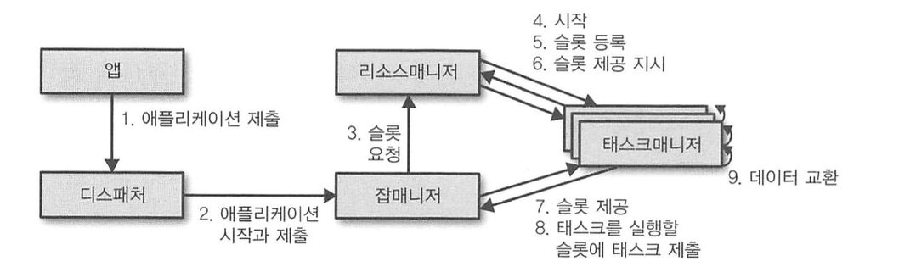

### 애플리케이션 배치 (deploy)

> 플링크는 두 가지 방식으로 어플리케이션을 배치(deploy) 한다.

- 프레임워크 방식 (전통적 접근)
  - 플링크 어플리케이션을 하나의 JAR로 패키징한 후, client를 이용해 현재 실행 중인 서비스 중 하나로 제출한다.
    - 서비스는 디스패처, JM, YARN의 리소스매니저가 될 수 있다.
    - 어떤 서비스를 사용하든, 클라가 제출한 플링크 app을 받아 실행하는 것을 보장한다.
  - JM에게 app을 제출하면 JM은 즉시 app을 시작한다.
  - 디스패처나 RM으로 app을 제출하면, 먼저 JM을 기동한 후, app을 JM에게 넘긴다. JM은 app을 즉시 시작한다.

- 라이브러리 방식 (MSA에서 일반적인 방식. 컨테이너 이미지 안에 라이브러리로 패키징한다.)
  - 플링크 어플리케이션을 app에 특화된 컨테이너 이미지로 만든다. 
    - 컨테이너 이미지는 JM와 RM을 실행할 코드를 포함한다.
  - 이미지에서 시작한 컨테이너는 JM과 RM을 자동으로 구동하고, 번들링돼 있는 잡을 제출한다.
  - 컨테이너 이미지를 배포할 때는 Job과 무관한 이미지를 사용한다.
    - 배포용 이미지는 TM을 시작하며, TM은 RM에 연결해 슬롯을 동록한다.
  - 외부 자원 관리자(k8s 등)에서 컨테이너 이미지를 시작하면, 장애가 발생할 때 컨테이너 재시작을 보장할 수 있다.

### 태스크 실행

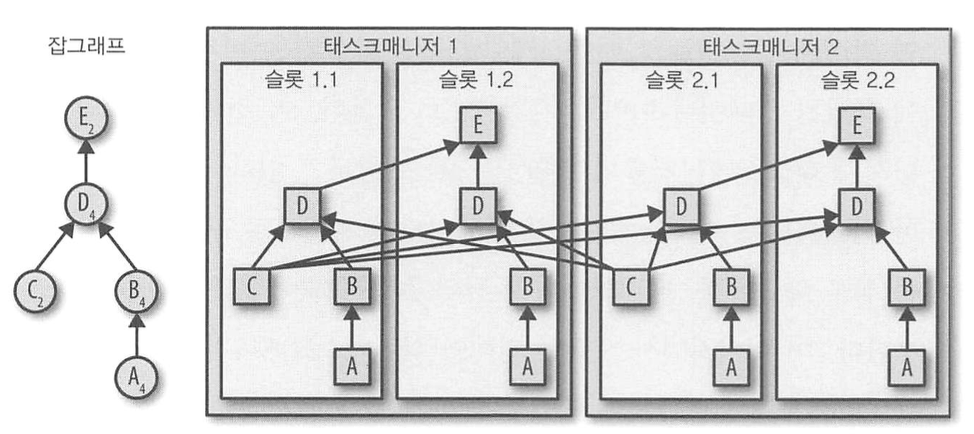

- TM은 여러 태스크를 동시에 실행할 수 있다. 
  - 태스크 = 같은 연산자(데이터 병렬화), 다른 연산자(태스크 병렬화), 다른 어플리케이션(잡 병렬화)
  - 연산자를 태스크로 분할해 슬롯에 할당할 경우, 여러 태스크를 같은 TM에 배포할 수 있다. 
    - 장점 : 같은 프로세스 안의 태스크들이 네트워크를 타지 않고 데이터 교환을 효과적으로 할 수 있다.
    - 단점 : 너무 많은 태스크를 같은 TM에 할당하면 TM 부하로 성능이 나빠질 수 있다.
- TM은 데이터 처리 슬롯 개수 설정을 제공한다. 따라서 동시 실행 가능한 태스크 수를 제어할 수 있다.
  - 슬롯을 병렬 태스크 같이, 스트리밍 애플리케이션의 일부분을 실행할 수 있다. 
- TM은 JVM 프로세스 안에서 멀티스레드로 태스크를 실행한다. 
  - 태스크 각각을 고립시켜 각각의 어플리케이션을 TM 장애로부터 고립시켜야 HA를 구현할 수 있다.
  - TM당 하나의 슬롯만 설정하고, TM 안에서는 스레드를 활용해 병렬로 작업하면 한 호스트에 여러 TM 프로세스를 배치할 수 있다. 

### 고가용성 설정

> 스트리밍 어플리케이션은 24/7 원칙에 따라, app 일부에 장애가 발생해도 app 실행이 중단되지 않게 해야한다.  
> 만약 실패에서 복구하려면, 우선 실패한 프로세스를 재시작한 이후 app과 상태를 재시작해야 한다.

[//]: # (TODO)
- 태스크 매니저 실패 (???) 
  - TM이 실패 -> 가용 슬롯 감소 -> JM은 RM에게 더 많은 슬롯 요청 -> ... 
  - 따라서 슬롯 제공 요청이 불가능할 때, JM은 충분한 슬롯을 확보하기 전까지 어플리케이션을 재시작할 수 없다.
  - 어플리케이션 재시작 전략은 JM이 얼마나 자주 app을 재시작하고 재시작 시도 동안에 얼마나 오래 기다릴지를 결정한다.

- 잡매니저 실패
  - JM은 완료한 체크포인트 정보와, 스트리밍 어플리케이션 실행 제어와 관련된 메타데이터를 유지한다. 
    - 따라서 JM이 사라질 경우, 스트리밍 어플리케이션은 레코드를 더 처리할 수 없다.
    - 즉, JM은 어플리케이션의 SPOF 이다. 
  - 플링크는 JM이 죽으면 다른 JM으로 책임과 메타데이터를 넘기는 고가용성 기능을 제공한다.
    - 조율 & 합의를 제공하는 주키퍼를 이용해 리더 선출과 고가용성을 실현한다.
    - 고가용성 모드로 운영할 때, JM은 필수 메타데이터를 원격의 영구 저장 시스템에 저장한다. 그리고 메타데이터 저장 위치도 주키퍼에 저장한다.
      - 어플리케이션 실행 중, JM은 각 태스크 체크포인트 위치 정보를 수집하고, 체크포인트 완료 시점이 되면 태스크 상태 정보를 원격 저장소에 저장한다.
      - 주키퍼에는 이 저장 위치를 저장한다.
      - 즉, JM이 실패할 때 복구에 필요한 데이터는 원격 저장소에, 주키퍼에는 복구 데이터 위치를 저장한다.
  - 잡매니저 실패 -> 어플리케이션에 속한 모든 태스크가 자동 취소 처리 -> 새로운 JM은 모든 작업을 인계받고 작업 시작
    - 원격 저장소의 잡그래프, JAR 파일, 마지막 체크포인트 위치를 주키퍼에게 요청한다.
    - 어플리케이션을 계속 실행할 때 필요한 처리 슬롯을 RM에게 요청한다.
    - 어플리케이션을 재시작하고 모든 태스크의 상태를 마지막 완료한 체크포인트로 재설정한다.
  - k8s와 같은 환경에서 라이브러리 방식으로 실행했다면, 컨테이너 오케스트레이션 서비스가 JM, TM 컨테이너를 자동으로 재시작한다. 
    - 독립형 클러스터 환경에선 실패 프로세스를 재시작하는 도구를 제공하지 않으므로, 대기 잡매니저와 TM을 실행하는게 나을 수 있다.

---

## 플링크 내부의 데이터 전송

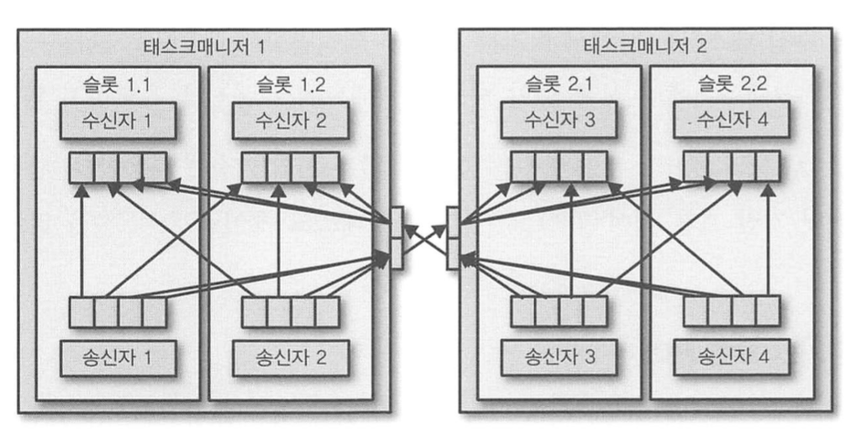

- TM은 전송 태스크에서 수신 태스크까지 데이터를 전송한다. TM 네트워크 컴포넌트는 데이터를 전송하기 전에 버퍼에 레코드를 모은 후, 배치로 레코드를 전송한다. 
- 각 TM은 데이터 송수신에 사용하는 네트워크 버퍼 풀을 가지고 있으며, 만약 송수신 태스크매니저가 서로 다른 프로세스에서 동작한다면 OS의 네트워크 스택을 통해 통신할 것이다. 
- TM은 1:1 관계의 전통 TCP 연결을 유지해 다른 TM과 데이터를 교환한다. 
- 셔플 연결 패턴에서 각 전송 태스크는 각 수신 태스크로 데이터를 전송할 수 있어야 한다. 
  - TM은 내부적으로 전송 -> 수신으로 데이터를 보낼 때 쓸 수 있는 전용 네트워크 버퍼를 가져야 한다.
- 동일한 태스크매니저로 전송할 태스크 버퍼들은 동일 네트워크 연결을 통해 다중 전송된다. 
- 파이프라인 방식으로 매끄럽게 데이터를 교환하기 위해, TM은 외부로 나가거나 들어오는 모든 연결을 동시에 처리할 만큼 충분한 버퍼를 가져야 한다.
  - 데이터를 셔플링하거나 브로드캐스트 하는 연결이라면 -> 각 전송 태스크는 각 수신 태스크에 대한 버퍼를 하나씩 가져야 한다. 
  - 이때 필요한 퍼버의 수 = 연산에 참여한 태스크 수의 제곱이다.
- 플링크 기본 네트워크 버퍼 설정은 중소규모 클러스터에서 쓰기 충분하고, 그 이상이라면 설정 최적화가 필요하다.

전송 태스크와 수신 태스크가 동일 TM 프로세스에서 실행될 때 아래 과정을 거치므로, 동일 TM에서 실행 중인 태스크는 네트워크 통신을 유발하지 않는다.
- 전송 태스크 : 외부로 나가는 레코드를 바이트 버퍼로 직렬화 -> 버퍼 꽉 차면 큐에 삽입
- 수신 태스크 : 큐에서 버퍼 인출 -> 역직렬화해 레코드로 만든다.

태스크 사이의 통신 비용을 줄이기 위해, 크레딧 기반 흐름 제어와 태스크 체이닝을 사용할 수 있다. 

### 크레딧 기반 흐름 제어

단일 네트워크 연결은 비효율적이고 부하가 크므로 버퍼링 사용을 통해 네트워크 연결 대역폭을 최대한 이용해야 한다. 

하지만 스트리밍 처리 관점에서, 버퍼링은 레코드가 버퍼에 모이는 걸 기다려야 하므로, 지연 시간이 생긴다는 단점을 갖는다. 

이를 보완하기 위해 플링크는 크레딧 기반 흐름 제어를 구현한다. 

1. 수신 태스크가 전송 태스크에 크레딧 부여
   - 크레딧 : 수신 태스크가 데이터를 수신하기 위해 예약한 네트워크 버퍼 개수.
2. 알림 받은 전송 태스크는 부여받은 크레딧만큼의 버퍼와 백로그 크기를 수신 태스크에게 전송
   - 백로그 크기 : 가득 차서 전송할 준비가 된 네트워크 버퍼 수
3. 수신 태스크는 예약한 버퍼로 도착한 데이터를 처리한 후, 전송 태스크의 백로그 크기를 이용해 연결된 모든 전송 태스크의 다음 크레딧을 우선순위 방식으로 정한다.

이처럼 크레딧 기반 흐름제어는 
- 수신 태스크가 데이터를 받을 수 있는 자원을 준비하자마자 데이터를 전송하므로 지연 시간을 줄일 수 있다.
- 데이터의 전송이 특정 태스크에 평향되어 있을 때 전송 태스크 백로그 크기에 따라 크레딧을 부여하여, 네트워크 자원을 균등하게 분배할 수 있다. 

> 따라서 크레딧 기반 흐름 제어는 플링크가 높은 처리율과 짧은 지엽을 낼 수 있도록 도와준다. 

### 태스크 체이닝

태스크 체이닝은 특정 조건에서 로컬 통신의 부하를 줄여줄 수 있다. 이를 사용하기 위해 다음 조건을 충족해야 한다.

1. 두 개 이상의 연산자가 동일한 병렬 값으로 설정되어 있어야 한다.
2. 연산자들이 로컬 포워드 채널로 연결되어야 한다. 
   - 로컬 포워드 채널 : 같은 작업자 (TM) 내에서 연산자간 데이터 전송을 최적화하기 위해 사용되는 데이터 전달 채널

이를 충족한 연산자 파이프라인 예시는 다음과 같다. 

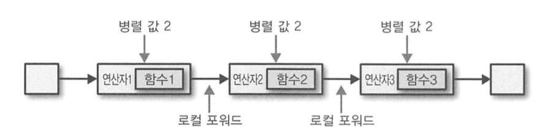

여기서 태스크 체이닝으로 파이프라인을 실행한 예시는 다음과 같다. 

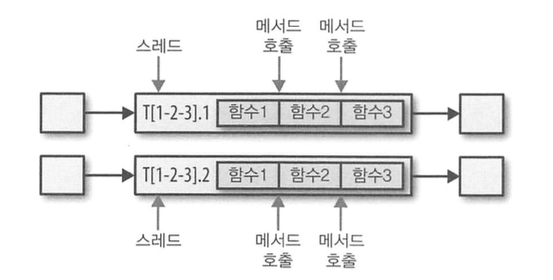

예시와 같이, 플링크는 모든 연산 함수를 태스크 하나에 합쳐 실행하고, 각 태스크를 스레드 하나에서 실행한다. 

태스크는 한 함수가 생산한 레코드를 단순 메서드 호출을 통해 다음 함수로 넘기므로, 함수간 레코드 전달에 직렬화나 통신 비용이 부과되지 않는다. 

따라서 태스크 체이닝은 로컬 태스크 간의 통신 비용을 극적으로 줄여준다.

> 단, 많은 태스크로 구성된 긴 파이프라인을 분할하거나, 태스크 체인을 여러개로 쪼개 부하가 큰 함수를 서로 다른 슬롯에 할당할 수 있다.  
> 이럴 땐 태스크 체이닝 없이 파이프라인을 실행하는 것이 옳다.  
> 태스크 체이닝은 기본적으로 활성화되어있으므로, 어플리케이션별로 태스크 체이닝을 비활성화하거나, 개별 연산자에서 태스크 체이닝 동작을 제어할 수 있다.

---

## 이벤트 시간 처리

- 처리 시간
  - 장점 : 이벤트 처리가 실행 중인 장비 로컬 시간 기반이라 이해가 쉽다
  - 단점 : 처리 결과가 부정확하거나, 일관성이 떨어지거나, 결과 재생산이 불가능할 수 있다.
- 이벤트 시간
  - 장점 : 재생산 가능하고 일관성 있는 결과를 만들어낸다. 
  - 단점 : 추가적인 설정이 필요하고, 이벤트 시간을 지원하는 스트림 처리기 내부가 복잡하다.

플링크는 기본 연산자 뿐 아니라, 사용자 정의 연산자를 이용해 복잡한 이벤트 시간 기반 어플리케이션을 개발할 수 있도록 돕는다. 

### 타임스탬프

> 플링크 이벤트 시간 어플리케이션이 처리하는 모든 레코드는, 레코드를 특정 시점(보통 레코드가 표현하는 이벤트 발생 시점)과 결부시키는 타임스탬프를 동반해야 한다. 

- 이벤트 시간 모드로 데이터 스트림을 처리하는 경우 : 레코드 타임스탬프를 이용해 시간 기반 연산자를 실행한다.
  - 플링크는 타임스탬프를 16바이트 Long 값으로 변환해 레코드 메타데이터에 첨부한다.
  - 플링크 기본 연산자들은 Long 값을 유닉스 타임스탬프로 해석한다.
    - 사용자 정의 연산자에서 사용자 정의 방식 (ex. ms)으로 해석할 수도 있다.

### 워터마크

> 이벤트 기반 어플리케이션의 각 태스크는 워터마크를 이용해 현재 이벤트 시간을 얻는다.

- 시간 기반 연산자는 이벤트 시간을 이용해 연산을 시작하거나, 스트림을 앞으로 진행시킨다.
- 플링크는 워터마크를 Long 값을 타임스탬프를 갖고 있는 특별한 레코드를 추가해 구현한다.

워터마크는 다음의 두 기본 속성을 갖는다.

1. 워터마크는 태스크 이벤트 시간 시계가 앞으로만 흘러가게 하고, 역행하지 않게 한다.
2. 워터마크는 레코드의 타임스탬프와 관련 있다.
   - T 스탬프를 가진 워터마크 = 이후의 모든 레코드의 타임스탬프가 T보다 커야 함을 의미

즉, 워터마크를 이용해, 레코드의 타임스탬프 순서가 바뀐 스트림을 처리할 수 있다. 

시간 기반 연산자를 실행하는 태스크는 순서가 바뀌었을 수도 있는 레코드들을 수집하고, 이벤트 시간 시계가 해당 타임스탬프와 관련된 레코드가 더 들어오지 않을 것이라 예상할 때 연산을 시작한다. 

만약 연산 중, 태스크가 워터마크 속성을 위반하는 레코드를 받으면, 이를 연착 레코드로 판단 (= 이미 연산이 종료된 레코드) 하고, 플링크 기능을 이용해 처리할 수 있다. 

워터마크는 어플리케이션 결과의 완성도와 지연을 어플리케이션을 제어할 수 있게 돕는다.
- 레코드 타임스탬프에 가까운 워터마크는 처리 지연을 짧게 만들지만, 결과의 완성도를 떨어뜨린다. 
- 워터마크를 보수적으로 정하면 처리 지연은 길어지지만 결과의 완성도는 높아진다.

### 워터마크 전파와 이벤트 시간

플링크는 워터마크를 연산자 태스크가 받아서 내보내는 특별한 레코드로 구현한다. 
- 태스크는 내부에 타이머 서비스를 가진다.
- 타이머 서비스는 타이머를 유지하고, 워터마크가 도착할 때마다 타이머를 활성화한다.
- 태스크는 타이머 서비스에 타이머를 등록해, 미래의 특정 시점에 어떤 연산을 수행할 수 있다. 

태스크가 워터마크를 받으면 다음의 동작이 벌어진다.
1. 태스크는 내부 이벤트 시간 시계를 워터마크 타임스탬프 기준으로 갱신한다.
2. 태스크의 타이머 서비스는 갱신한 이벤트 시간보다 오래된 타이머를 모두 찾는다.
  - 시간이 만료된 타이머를 등록한 태스크는 어떤 연산을 수행하거나, 레코드를 내보내는 콜백 함수를 호출한다.
3. 태스크는 갱신한 이벤트 시간을 워터마크에 실어서 내보낸다.

> 타임스탬프나 워터마크에 접근하기 위해서 특정 DataStream API를 사용해야하며, 대부분의 함수는 레코드의 타임스탬프와 워터마크를 읽거나 수정할 수 없다. 즉 쓰기만 가능함.  
> 예외적으로 현재 처리 중인 레코드의 타임스탬프를 읽거나 현재 이벤트 시간을 요청하고 타이머를 등록할 수 있다. 

플링크는 데이터 스트림을 파티션으로 분할하고, 각 파티션을 개별 연산자 태스크에 할당해 병렬로 처리한다. 

이때 각 파티션은 타임스탬프가 있는 레코드와 워터마크를 흘려보내는 스트림으로, 태스크 앞뒤에 어떤 연산자와 연결되어 있는지에 따라 태스크는 여러 입력 파티션에서 레코드와 워터마크를 수신하고, 여러 출력 파티션으로 레코드와 워터마크를 전송할 수 있다.

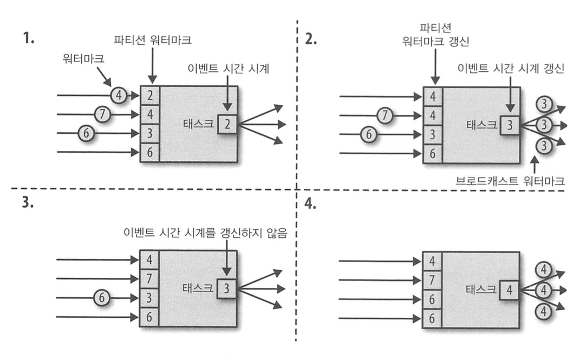

태스크가 여러 출력 태스크로 워터마크를 내보내고, 입력 태스크에서 수신한 워터마크를 이용해 이벤트 시간 시계를 앞으로 흐르게 하는 방법은 다음과 같다. 

1. 태스크는 각 입력 파티션에 대해 하나의 워터마크를 유지한다. 
   - 입력 파티션에서 워터마크를 받으면 해당 파티션의 현재 워터마크 값과 새 워터마크 값을 비교해 최대값으로 갱신한다.
2. 이후 태스크는 모든 입력 파티션의 워터마크 중 최솟값으로 이벤트 시간 시계 값을 갱신한다. 
3. 이벤트 시간 시계가 앞으로 흐르면, 태스크는 등록된 타이머 중 만료된 모든 타이머를 활성화한다.
4. 연결된 모든 출력 파티션으로 새 워터마크를 내보내, 전체 하위 스트림 태스크가 새 이벤트 시간을 받게 한다. 

두 개 이상의 입력 스트림을 가지는 연산자의 태스크는 워터마크가 다른 입력 스트림에서 나와도, 같은 파티션에서 나온 워터마크로 취급한다. 

따라서 두 입력의 레코드는 같은 이벤트 시간 시계를 기반으로 처리되며, 따라서 이벤트 타임스탬프가 동기화되어 있어야 한다. 

플링크의 워터마크 처리와 전파 알고리즘은 이를 위해 연산자 태스크가 생성한 레코드가 워터마크와 최대한 동기화된 타임스탬프를 갖도록 보장하고, 모든 파티션이 지속적으로 증가하는 워터마크를 제공해야 한다.

이때, 만약 어떤 파티션의 워터마크가 유휴상태에 빠져 앞으로 가지 못하고 레코드나 워터마크를 내보내지 않는다면, 태스크 이벤트 시간 시계는 멈추고, 태스크 타이머도 트리거되지 않을 것이다. 

이는 워터마크 시간이 심하게 차이나는 두 입력 스트림을 처리하는 연산자에서 비슷하게 발생하며, 이때 태스크의 이벤트 시간 시계는 느린 스트림의 워터마크에 맞춰지고, 빠른 스트림의 레코드나 중간 결과는 이벤트 시간 시계가 처리를 허용할 때까지 상태에 버퍼링된다. 

### 타임스탬프 할당과 워터마크 생성

보통 스트림 어플리케이션으로 스트림 데이터가 들어올 때 타임스탬프를 할당하고 워터마크를 생성한다. 

타임스탬프 결정은 어플리케이션이, 워터마크는 타임스탬프와 스트림의 특성에 의존하므로, 어플리케이션이 명시적으로 타임스탬프를 할당하고 워터마크를 생성해야 한다. 

플링크가 타임스탬프를 할당하고 워터마크를 생성하는 방식은 아래 세가지가 있다. 

- 소스에서 (SourceFunction)
  - 어플리케이션으로 스트림이 들어올 때 타임스탬프를 할당하고 워터마크를 생성할 수 있다.
  - SourceFunction은 레코드 스트림을 내보낸다.
    - 타임스탬프는 레코드와 함께 나가고, 워터마크는 특별한 레코드로 특정 시점에 나갈 수 있다.
    - 일시적으로 SourceFunction이 워터마크를 더이상 내보내지 않는다면, 자신을 유휴 상태로 선언할 수 있다. 
    - 플링크는 유휴 상태 스트림 파티션을 다음 연산자 워터마크 계산에서 제외한다. 이후 앞으로 나가지 않는 워터마크를 다룰 때 사용할 수 있다.
 
- 주기적인 할당자 (periodic assigner)
  - DataStream API는 각 레코드에서 타임스탬프를 추출하는 사용자 정의 함수를 지원한다.
  - 이 함수를 주기적으로 질의해 현재 워터마크를 알아내고, 이를 레코드에 할당한다.
  - 질의한 워터마크는 스트림에 주입한다.

- 구두점 할당자 (punctuated assigner)
  - AssignerWithPunctuatedWatermarks라는 사용자 정의 함수를 통해, 각 레코드에서 타임스탬프를 추출할 수 있다.
  - 이 함수를 통해, 특별한 입력 레코드에 포함된 워터마크를 추출할 수 있다.

---

## 상태 관리

대부분의 스트리밍 어플리케이션은 상태를 갖고 있고, 상태가 있는 연산자는 지속적으로 상태를 읽고 갱신한다. 

플링크는 모든 상태를 동일하게 취급하며, 보통 태스크의 상태는 태스크가 유지하고 있는 데이터와 함수의 결과를 계산할 때 사용하는 모든 데이터를 포함한다. 

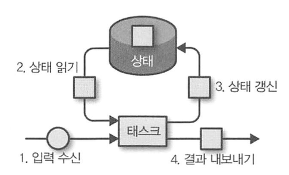

태스크는 입력 데이터를 수신한다
- 데이터 처리 중 태스크는 상태를 읽거나 갱신할 수 있다. 
- 또한 입력 데이터와 현재 상태를 기반으로 새로운 결과를 생산할 수 있다.

플링크에서 상태는 항상 특정 연산자와 연관되이 있으며, 어플리케이션을 실행할 때 플링크가 연산자의 상태를 알 수 있게 하기 위해 연산자는 자신이 사용할 상태를 등록해야 한다. 

이때 상태에는 연산자 상태, 키 상태의 두 가지 종류가 있다. 

### 연산자 상태

연산자 상태의 스코프는 연산자 태스크 하나로, 한 태스크가 처리하는 모든 레코드가 동일 상태에 접근할 수 있다. 

같은 연산자이든 다른 연산자이든, 태스크가 다르면 다른 연산자 상태에 접근할 수 없다. 

플링크는 세 종류의 기본 연산자 상태를 제공한다. 

- 리스트 상태 : 리스트의 요소들로 상태를 표현한다.
- 유니온 리스트 상태 : 리스트 요소로 상태를 표현하는 건 동일하지만, 장애 복구 & 세이브포인트에서 시작할 때 차이가 있다.
- 브로드캐스트 상태 : 연산자의 모든 태스크 상태가 동일한 특수 상황에 사용하는 연산자 상태.
  - 체크포인팅을 수행하거나, 연산자를 재확장할 때 사용할 수 있다. 

### 키 상태

레코드의 각 키 값별로 유지하고 접근할 수 있는 상태.

플링크는 각 키 값별로 하나의 상태 인스턴스를 유지하고, 이 키 상태를 관리하는 연산자 태스크로 동일 키의 모든 레코드를 전송한다. 

따라서 태스크가 어떤 레코드를 처리할 때 현재 처리 중인 레코드의 키와 일치하는 키 상태만 접근할 수 있다. 즉, 같은 키를 가진 모든 레코드는 같은 레코드에 접근한다. 

Key-Value 처럼 키 값으로 연산자 병렬 태스크에 레코드를 분배한 컷이 키 상태로, 플링크는 키 별로 저장할 수 있는 여러 상태 값 종류를 제공한다.

- 값 상태 (Value State) : 임의 타입의 값을 키별로 저장한다. 복잡한 데이터 구조도 값 상태로 저장 가능하다.
- 리스트 상태 (List State) : 각 키별로 값 리스트를 저장한다. 리스트 요소는 어떤 타입도 가능하다.
- 맵 상태 (Map State) : 키별로 키-값 맵을 저장한다. 맵의 키와 값은 어떤 타입도 가능하다.

### 상태 백엔드

상태가 있는 연산자 태스크는 들어오는 레코드마다 상태를 읽고 갱신하므로, 짧은 지연으로 레코드를 처리하기 위해 상태를 로컬에 유지해, 고속의 상태 접근을 보장한다.

상태의 저장/접근/유지는 상태 백엔드라는 플러그인 가능한 컴포넌트가 결정하며, 상태 백엔드는 로컬 상태 관리와 원격 저장소에 상태를 체크포인팅하는 역할을 수행한다.

- 상태 로컬 유지
  - 모든 키 상태를 저장하고, 키 상태의 접근을 현재 키 스코프에서만 가능하게 보장하여 상태를 로컬에 유지한다.
  - 플링크는 JVM heap 처럼 메모리 상태 백엔드를 제공하며, 상태 객체를 직렬화하고 RocksDB에 저장하는 RocksDB 상태 백엔드도 지원한다.
    - 메모리 기반은 고속의 접근을 허용하나 메모리 크기 제약이 있고, RocksDB 상태 백엔드는 접근은 느리지만 상태 크기는 천천히 증가한다.
- 체크포인트
  - 플링크는 상태를 로컬에서 관리하므로 체크포인트 관리가 중요하다.
    - TM 프로세스는 언제든 장애가 발생할 수 있으므로, 휘발성이라고 생각해야 한다. 
  - 따라서 상태백엔드는 원격의 영구 저장소(분산 파일 시스템이나 DB 등)에 태스크 상태를 체크포인팅한다. 
    - 상태 백엔드는 상태 체크포인팅 방식에 따라 다르다. RocksDB 상태 백엔드의 경우 증분 체크포인트를 지원한다.

### 상태가 있는 연산자의 수평 확장

상태가 있는 연산자의 병렬 값 변경은 상태를 재분할해 늘어난 병렬 태스크에 다시 할당해야 하는 어려움이 있다.

플링크는 상태의 수평 확장을 위한 네 가지 패턴을 지원한다.

- 키 상태를 사용하는 연산자
  - 수평 확장할 때, 병렬 태스크가 가진 키들을 더 적거나 많게 재분할한다.
  - 이때 효율적인 상태 재분배를위해, 개별 키 단위로 재분배하는 대신, 키를 키 그룹으로 구조화한다.
    - 하나의 키 그룹은 하나의 키 파티션이며, 플링크는 키 그룹 단위로 태스크에 여러 키를 할당한다. 

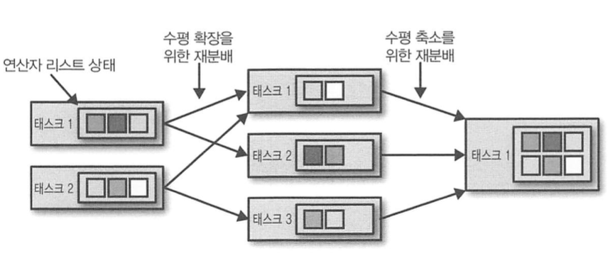

- 리스트 상태를 사용하는 연산자 
  - 수평 확장할 때, 리스트 요소를 재분배해 확장한다.
  - 모든 병렬 태스크가 가진 리스트 요소를 수집해 새 태스크로 균등하게 재분배한다. 
  - 만약 리스트 요소 개수가 연산자의 새 병렬 값보다 작으면, 일부 태스크는 비어있는 상태로 시작할 수 있다. 

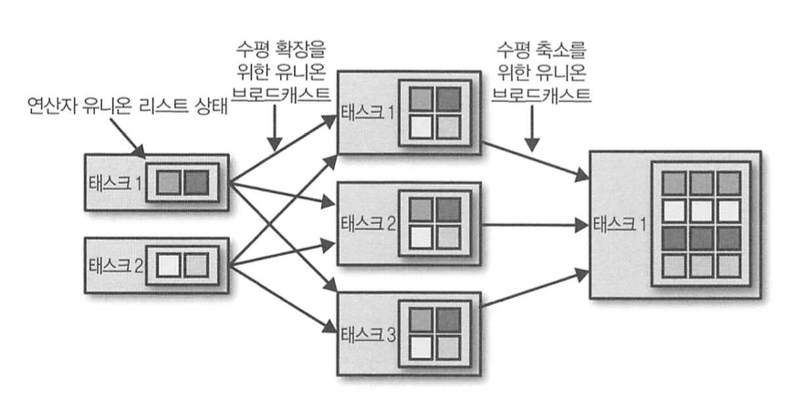

- 유니온 리스트 상태를 사용하는 연산자
  - 모든 리스트 요소를 각 태스크로 브로드캐스트 해서 확장한다.
  - 각 태스크는 어떤 리스트 요소를 사용하고 버릴지 직접 선택한다.

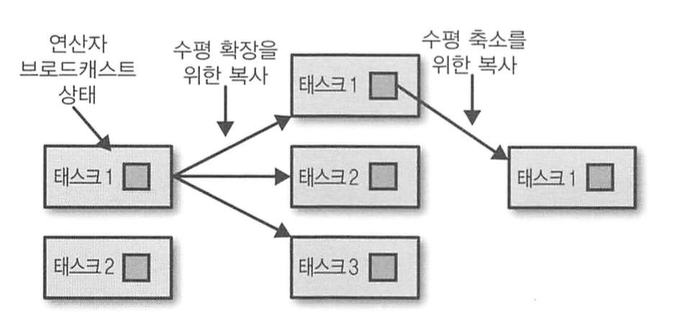

- 브로드캐스트 상태를 사용하는 연산자 
  - 상태를 새로운 태스크로 복사해 확장한다.
    - 브로드캐스트 상태는 모든 태스크가 동일한 상태를 가졌다는 것을 보장하므로 가능한 방식!
  - 규모를 축소할 때 필요가 없어진 태스크는 단순 취소되지만, 상태가 복사되었기에 유실될 일이 없다.

---

## 체크포인트, 세이브포인트, 상태 복구

### 일관성 체크포인트

플링크의 장애 복구 방식은 어플리케이션 상태의 일관성 체크포인트에 기반한다. 

> 상태가 있는 어플리케이션에서의 일관성 체크포인트  
> 모든 태스크가 정확히 동일한 시점에 각 태스크의 상태를 복사하는 것

단순 알고리즘을 통해 어플리케이션 일관성 체크포인트 동작을 설명할 수 있다. 
1. 모든 입력 스트림의 인입 정지
2. 현재 처리 중인 데이터가 완료되기까지 대기
3. 각 태스크의 상태를 복사해 원격의 영구 저장소로 체크포인트 지정. 상태 복사 끝나면 체크포인팅 완료
4. 모든 스트림의 인입 재시작

플링크는 여기서 좀 더 정교한 알고리즘을 이용한다 (뒷 절에 나옴)

### 일관성 체크포인트에서 복구

스트리밍 어플리케이션 실행 동안 플링크는 주기적으로 일관성 체크포인팅을 수행하고, 장애가 발생하면 원격 저장소에서 제일 최신 체크포인트를 가져와 상태를 복구하고 레코드 처리를 재시작한다. 

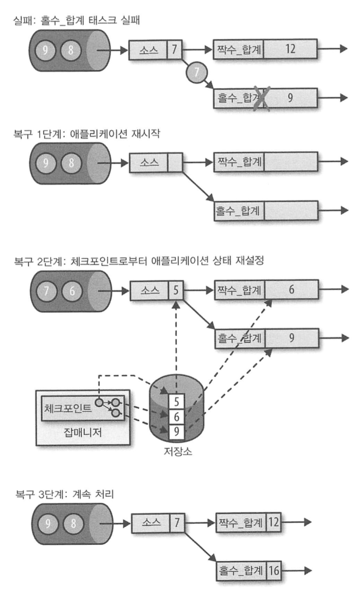

이를 정리하면, 어플리케이션 복구 단계를 다음과 같이 나타낼 수 있다. 

1. 전체 어플리케이션 재시작
2. 상태가 있는 모든 태스크 상태를 가장 최신의 체크포인트로 재설정
3. 모든 태스크 처리 재시작

모든 상태가 복구된 후, 모든 입력 스트림 위치가 체크포인팅 수행 당시 마지막으로 소비했던 위치로 재설정되면, 체크포인트와 복구 방식으로 어플리케이션 상태의 정확히 한 번 일관성을 제공할 수 있다. 

데이터 소스 입력 스트림 재설정 여부는 데이터 소스의 구현과 외부 시스템이나 데이터 소스 스트림이 데이터를 가져오는 인터페이스에 달려있다.

> 즉, 어플리케이션의 모든 입력 스트림이 재설정 가능한 데이터 소스에서 데이터를 소비하면 정확히 한 번 상태 일관성을 유지할 수 있다.

체크포인트에서 어플리케이션을 재시작할 때, app 내부 상태는 제일 최신 체크포인트 시점의 상태와 동일하다. 

따라서 상태 복구 후, 어플리케이션은 장애로 중단된 시간 동안 쌓여있던 모든 데이터를 재처리한다. 

마치 일부 메세지가 중복 처리되는 것처럼 보이지만, 모든 연산자의 상태가 이 데이터들을 처리하기 전으로 돌아갔으므로 정확히 한 번 상태 일관성이 보장된다. 

### 플링크의 체크포인트 알고리즘 (다시 보기)

스트림 어플리케이션 전체에서 동시에 체크포인팅을 수행하는 방식은 app 전체에 대해 STW를 일으키므로 사실상 불가능하다.

플링크는 챈디-램포트 알고리즘을 기반으로 분산 스냅샷 체크포인팅을 구현했다. 

> 챈디-램포트 알고리즘  
> 마커 메세지를 이용해, 분산 환경에서 상태를 기록할 시간을 구분한다.  
> 마커가 도착하기 전후의 메세지를 구분해 저장하여 순서를 정확히 기록할 수 있다.  
> 어플리케이션 전체를 정지하지 않고 체크포인트와 데이터 처리 간의 결합을 분리한다.

- 플링크의 체크포인트 알고리즘
  - 체크포인트 배리어 라는 레코드를 이용한다.
  - 소스 연산자는 레코드 스트림에 체크포인트 배리어를 주입하고, 체크포인트 배리어는 레코드가 어떤 체크포인트에 속했는지에 대한 식별자를 실어 나른다.
  - 체크포인트 배리어는 스트림을 배리어 전후로 나누며, 배리어 전의 레코드가 만든 상태 변경은 현재 체크포인트에, 후 레코드가 만든 상태 변경은 다음 체크포인트에 포함된다.

### 체크포인트가 성능에 미치는 영향 (다시 보기)

체크포인트 알고리즘을 통해 STW 없이 분산 체크포인팅을 수행할 수 있으나, 어플리케이션 처리 지연이 증가할 수 있다. 

이런 성능상 충격을 완화할 수 있도록 플링크는 체크포인트 알고리즘을 약간 변형했다. 

- 태스크가 상태를 체크포인팅하는 동안 모든 처리가 중지되고, 입력 데이터는 버퍼에 쌓인다. 
  - 상태가 클 수도 있고, 원격 저장소에 접근해야 하므로 체크포인팅 시간이 길어질 수 있다.
  - 체크포인팅 수행은 상태 백엔드의 구현에 따라 달라진다.
    - 파일 시스템 상태 백엔드나 RocksDB 상태 백엔드는 비동기 체크포인팅을 지원한다. 태스크는 상태 로컬 복사 후 하던 일 마저하고, 백그라운드 스레드가 로컬 스냅샷을 원격 저장소에 비동기로 복사한다.
- 또한, 배리어 정렬 단계를 변형해 체크포인트 알고리즘의 성능 저하를 줄일 수 있다.
  - 매우 짧은 지연과 최소 한 번 상태 보장으로 충분하다면, 배리어 정렬 시 배리어 도착 후 들어오는 레코드를 버퍼에 쌓지 않고 계속 처리하게 설정한다.
  - 체크포인트의 모든 배리어가 도착하면 연산자의 상태 체크포인팅을 시작한다.
  - 이때 장애가 발생하면, 체크포인트 배리어 이후 레코드를 다시 처리하고, 이때 체크포인트는 최소 한 번 일관성을 보장하게 된다.

  
- 세이브포인트
  - 세이브포인트는 체크포인트와 같은 알고리즘을 사용하되, 체크포인트에 몇 가지 메타데이터를 추가해서 만든다.
  - 플링크는 자동으로 세이브포인팅을 수행하지 않으므로, 사용자가 명시적으로 생성해야 한다. 플링크는 세이브포인트 자동 삭제도 지원하지 않는다.

- 세이브포인트 사용하기
  - 호환성을 가진 세이브포인트가 있다면 어플리케이션을 SP에서 시작하고, 상태를 SP 상태로 초기화할 수 있다.
  - 체크포인트와 똑같아보이지만, 체크포인트 장애 복구는 동일 클러스터에서 동일 설정으로 동일 어플리케이션을 시작하는 것이므로 조금 특별한 경우다.
  - 세이브포인트는 
    - 세이브포인트와 호환되는 (=세이브포인트 상태를 읽을 수 있는) 다른 어플리케이션을 시작할 수 있다. (= 버그 수정 후 상태 복구하고 입력 스트림의 이벤트 재처리 가능. A/B 테스트 가능 )
    - 동일 어플리케이션을 다른 병렬 값으로 시작하거나 규모를 확장하고 축소할 수 있다.
    - 다른 클러스터에서 동일 어플리케이션을 시작할 수 있다. (= app을 새 버전으의 플링크나 다른 클러스터, 다른 데이터센터로 마이그레이션할 수 있다.)
    - 어플리케이션을 정지시키고 나중에 재시작할 수 있다. 즉 우선순위가 더 높은 어플리케이션을 위해, 또는 입력 데이터가 지속적으로 생성되지 않을 때 클러스터 자원을 반납할 수 있다.
    - 어플리케이션 상태를 이력으로 남기거나 아카이빙하는데 사용할 수 있다. 

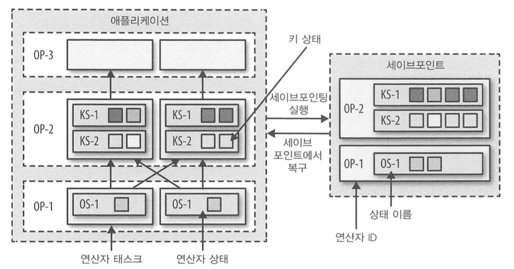

- 세이브포인트에서 어플리케이션 시작하기
  - 세이브포인트 사용 패턴은 대부분 유사하다. 
    - 실행 중인 어플리케이션의 세이브포인팅 -> 어플리케이션 시작할 때 상태 복구에 세이브포인트 사용하기
  - 세이브포인트에서 시작하는 app 상태를 초기화하는 방법
    - 플링크 어플리케이션은 여러 연산자로 구성되어 있고, 각 연산자는 하나 이상의 키 상태나 연산자 상태를 정의할 수 있다. 
    - 플링크는 연산자를 하나 이상의 연산자 태스크로 병렬 실행 하므로, 어플리케이션은 여러 TM 프로세스에서 실행 중인 연산자 태스크로 분산되어 있다. 
    - 세이브포인트의 상태 데이터는 연산자 식별자(ID)와 상태 이름을 가진다. 플링크는 세이브포인트와 관련있는 연산자가 있는 태스크로 세이브포인터 데이터를 재분배한다.
    - 만약 연산자에 ID가 설정되어있지 않으면 자동으로 할당한다. 
      - ID는 앞쪽의 연산자 식별자를 이용해 결정적으로 생성되므로, 앞 쪽의 연산자가 변경되면 현재 연산자 ID도 변경된다.
      - 따라서 상태를 유실해도 상관 없는 어플리케이션일때만 기본 연산자 식별자를 쓰도록 제한할 필요가 있다. 
      - 이외에는 기본 연산자 식별자 할당을 쓰지 말고, 연산자에 고유 식별자를 직접 부여하라.