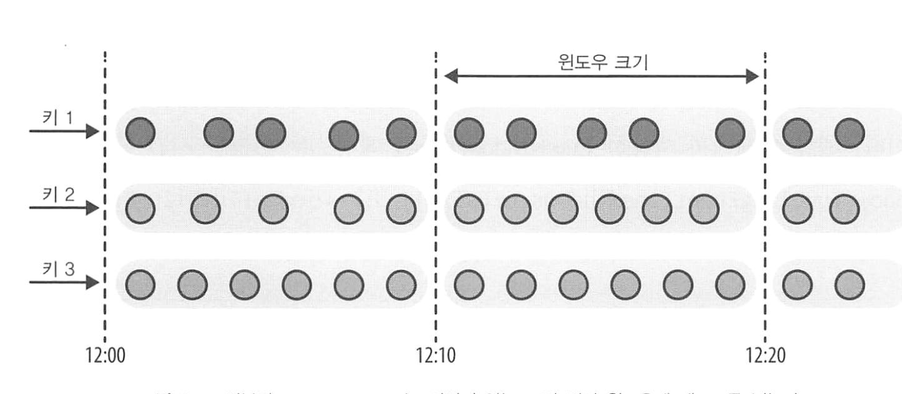
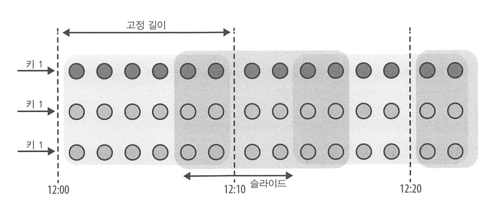
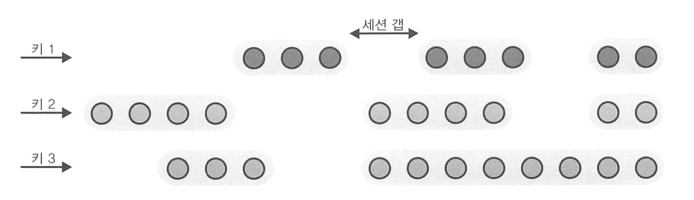
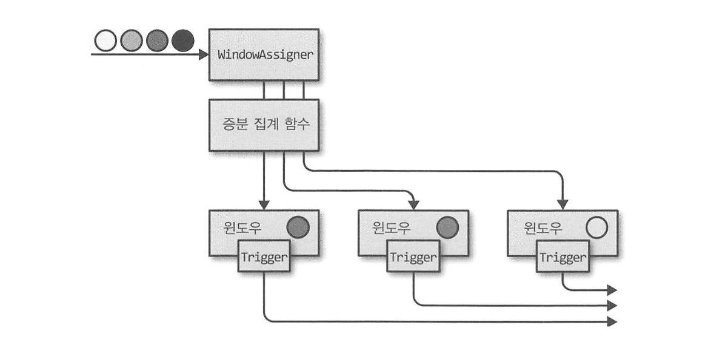
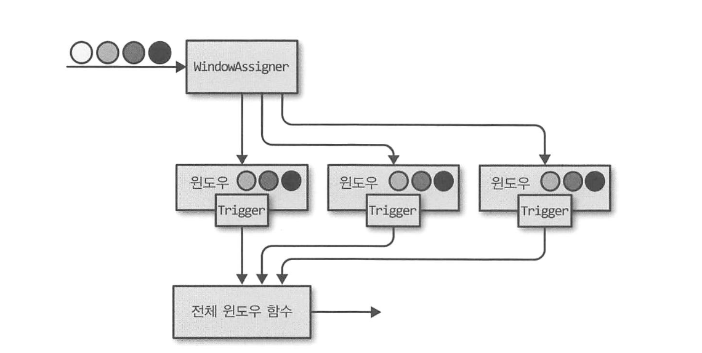
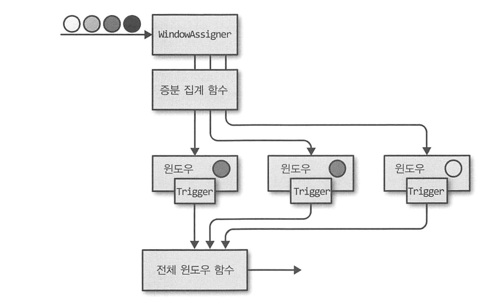
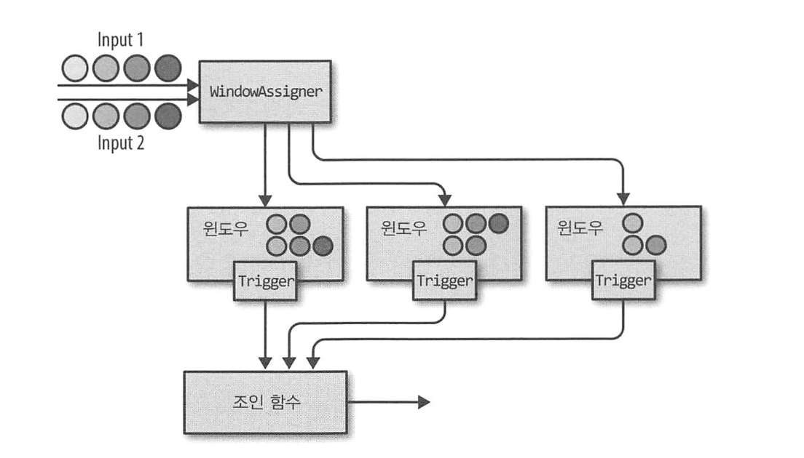

# 시간 기반 연산자와 윈도우 연산자

## 시간 특성 설정

시간 특성 (time characteristic)을 이용해 플링크가 시간을 어떻게 정의해야 하는지 알려줄 수 있다. 

시간 특성은 StreamExecutionEnvironment의 속성이며, 아래 값 중 하나다.

1. ProcessingTime 
   - 연산자가 스트림 처리가 실행 중인 장비의 시스템 시계로 데이터 스트림의 현재 시각을 결정하게 지정한다.
   - 장비 시스템 시계로 처리 시간 윈도우를 생성한다.
   - 처리 시간 윈도우는 윈도우 종료 시각까지 도착한 모든 이벤트를 포함해야 한다.
   - 윈도우 연산자에 따라 처리 시간을 적용하면
     - 이벤트 도착 속도에 따라 윈도우 내용이 달라지므로 비결정적인 결과가 생성된다.
     - 이벤트 처리 태스크가 이벤트 워터마크를 기다릴 필요가 없으므로, 매우 낮은 시간 지연을 제공할 수 있다.
2. EventTime
   - 연산자가 데이터 자체에서 얻은 정보를 이용해 현재 시각을 결정한다.
   - 워터마크가 어떤 시간 동안 모든 타임 스탬프를 수신했다고 선언하면 이벤트 시간 윈도우가 생성된다.
     - 이벤트 시간 윈도우는 이벤트 순서가 바뀌어 도착해도 결정적인 결과를 생성한다.
     - 당연함! 이벤트에 담긴 타임 스탬프를 이용하니까 꼬일 일이 없음
   - 따라서, 스트림 읽기와 이벤트 처리 속도에 무관하게 이벤트 시간 윈도우는 항상 같은 결과를 생성한다.
3. IngestionTime
   - 소스 연산자의 처리 시간을 입력 이벤트의 타임스탬프로 지정하고, 자동으로 워터마크를 생성한다.
   - EventTime과 ProcessingTime의 모든 특성을 포함한다.
     - 이벤트 인입 시간 = 이벤트가 스트림 처리기에 들어온 시간
     - EventTime에 비해 비결정적이나, 성능은 비슷하다.

### 타임스탬프 할당과 워터마크 생성

어플리케이션은 이벤트 시간 연산을 위해 플링크에 두 정보를 제공해야 한다.

1. 각 이벤트는 이벤트가 실제 발생한 타임스탬프를 가져야 한다.
2. 이벤트 시간 스트림은 연산자가 현재 이벤트 시간을 추론할 수 있는 워터마크를 보내야 한다.

타임스탬프와 워터마크는 **유닉스 시간을 ms로 지정**해야 한다.

`SourceFunction` 또는 `사용자 정의 타임스탬프 할당자와 워터마크 생성자`를 명시적으로 사용해, 타임스탬프를 할당하고 워터마크를 생성할 수 있다.

> 사용자 정의 타임스탬프 할당자는 기존 타임스탬프와 워터마크를 덮어쓴다.

- TimestampAssigner 인터페이스를 이용, 이벤트가 스트리밍 어플리케이션에 인입될 때 타임스탬프를 추출한다.
   - 타임스탬프 할당 호출 순서가 워터마크 생성에 영향을 미치므로, 보통 SourceFunction 직후에 호출된다.
   - 이벤트는 병렬이므로, 이벤트를 여러 병렬 파티션으로 재분배하는 병렬 값 변경이나 keyBy(), 또는 명시적 재분배 연산을 통해 이벤트 타임스탬프 순서를 바꿀 수 있다.

- 가능한, 타임스탬프 할당 및 워터마크 생성을 소스 근처 혹은 SourceFunction 안에서 하는게 제일 좋다.
  - 이벤트 재분배를 유도하지 않는 연산에 한해, 입력 스트림에 필터링이나 변환 연산을 적용한 후 타임스탬프를 할당할 수 있다.

- 이벤트 시간 연산이 기대처럼 동작하게 하려면, 이벤트 시간 이용 변환 연산 이전에 TimestampAssigner를 호출해야 한다.
  - TimestampAssigner은 호출된 후, 타임스탬프가 있는 새 이벤트 스트림과 워터마크를 생성한다.

- TimestampAssigner 인터페이스를 확장하는 두 인터페이스
  - AssignerWithPeriodicWatermarks (코드 예제)
    - 워터마크를 주기적으로 내보냄
      - 즉, 장비 시간을 기준으로, 고정 시간마다 워터마크를 내보내 이벤트 시간이 앞으로 흐르도록 시스템에 지시함
      - 기본 시간 간격은 200ms. 설정 가능함
    - 입력 이벤트가 단조 증가 타임스탬프를 가진 경우, 현재 타임스탬프를 이용해 워터마크를 생성하는 단축 메서드를 사용할 수 있다.
      - 단조 증가 타임 스탬프 = 시간이 항상 증가하거나 같아야 하는 타임스탬프.
      - 즉, 현재 타임스탬프보다 오래된 타임스탬프가 나타날 수 없음!
    - 입력 스트림의 최대 지연이 얼마인지 알 수 있다면, 연착 데이터를 처리하는 클래스를 사용할 수 있다.
      - 최대 지연 = 이전에 인입된 이벤트 중, `가장 큰 타임스탬프 - 현재 이벤트의 타임 스탬프`
  - AssignerWithPunctuatedWatermarks
    - 입력 이벤트 속성에 따라 워터마크 내보냄
      - 입력 스트림이 현재 진행 상황을 표기하는 특별한 표시를 포함하는 경우에 사용한다.
    - 이벤트마다 extractTimestamp()를 호출한 직후 checkAndGetNextWatermark()를 호출한다.
      - 이를 통해 새 워터마크를 생성할지 말지를 결정할 수 있다.
      - 만약 최근에 내부낸 워터마크보다 더 큰 Not Null 워터마크를 반환하면, 새 워터마크를 내보낸다.


### 워터마크가 지연과 완성도에 미치는 영향

워터마크를 사용하면 지연과 결과 완성도 사이의 균형을 맞출 수 있다.

- 워터마크는 연산을 수행하기 전 데이터가 도착할 때까지 얼마나 기다려야 할 지를 제어한다.
- 이벤트 시간 기반 연산자는 워터마크를 이용해, 인입 레코드의 완성도와 연산 진행 상태를 결정한다.
- 연산자는 수신한 워터마크를 통해 관련 입력 레코드가 언제까지 도착해야 하는지를 예측한다.

하지만 지연 없는 레코드가 존재할 수 없기에, 완전한 워터마크를 생성할 순 없다.

- 보통 경험적 추측과 휴리스틱 방법을 이용해 워터마크를 생성한다.
- 소스, 연산자 네트워크, 파티션 등을 이용해 입력 레코드의 진행 상태와 연착 상한 시간을 추정한다.
- 따라서, 어디까지나 추정값이기에, 오류가 발생해 부정확한 워터마크가 생성될 수 있다.

즉, 부정확한 워터마크로 인한 연착 데이터 및 불필요한 어플리케이션 지연이 발생할 수 있다는 점을 명심해야, 결과 지연과 완성도 간 균형을 맞출 수 있다. 

- 느슨한 워터마크
  - 워터마크가 앞서 처리한 레코드의 타임스탬프와 멀리 떨어져있는 경우
  - 결과는 더 많이 지연되며, 어플리케이션의 버퍼링 부담이 커지므로 상태 크기가 커진다.
  - 하지만 계산 수행 전 관련 모든 데이터가 도착했는지 확신할 수 있다.
- 빠듯한 워터마크
  - 워터마크가 앞서 처리한 레코드의 타임스탬프와 멀리 떨어져있지 않다
  - 관련 데이터가 모두 도착하기 전 시간 기반 연산이 실행될 수 있다.
  - 따라서 정확도는 낮으나, 낮은 지연 시간이 발생한다.

플링크는 워터마크 외에도 ProcessFunction과 윈도우 트리거를 제공해, 시간 기반 연산자가 정확하게 동작하도록 돕는다.

## ProcessFunction

- 레코드의 타임스탬프와 워터마크에 접근하고, 미래의 특정 시점에 동작할 타이머를 등록할 수 있다.
- 사이드 아웃풋 기능을 제공한다 :: 레코드를 여러 출력 스트림으로 내보낼 수 있다.

보통 이벤트 주도 어플리케이션 로직을 구축하거나, 미리 정의한 윈도우 / 기본 변환 연산이 사용자 로직 구현에 맞지 않을 때 주로 사용한다.

총 8개의 ProcessFunction이 있으며, 필요한 상황에 따라 사용하면 된다. 

모든 ProcessFunction은 RichFunction 인터페이스를 구현하므로, open(), close(), getRuntimeContext() 메서드를 제공한다. 

KeyedProcessFunction은 아래 두 메서드를 추가로 제공한다.

1. processElement()
   - 해당 메서드를 스트림 레코드마다 호출하며, 생성한 결과는 보통 Collector로 내보내진다.
   - Context 객체는 ProcessFunction을 특별하게 만든다.
     - 현재 레코드의 타임스탬프와 키, TimerService에 접근할 방법을 제공하며, 사이드 아웃풋으로 레코드를 내보낼 수 있다.
2. onTimer()
   - 콜백 함수로, 과거에 등록한 타이머가 트리거될 때 호출된다.
   - timestamp 인자는 타이머가 동작한 타임스탬프를 제공하고, Collector로 레코드를 내보낼 수 있다.
   - OnTimerContext는 processElement()의 Context와 같은 서비스를 제공하며, 트리거를 동작시킨 시간 도메인을 반환한다.
     - 여기서 시간 도메인은 처리 시간 혹은 이벤트 시간을 의미한다.

### TimeService와 타이머

TimeService는 다음 메서드들을 제공한다.

- currentProcessingTime() : 현재 처리 시간을 반환
- currentWatermark() : 현재 워터마크의 타임스탬프를 반환
- registerProcessingTimeTimer() : 현재 키의 처리 시간 타이머를 등록
- registerEventTimeTimer() : 현재 키의 이벤트 시간 타이머를 등록
- deleteProcessingTimeTimer() : 현재 키의 타이머 중 이전에 등록한 처리 시간 타이머를 제거
- deleteEventTimeTimer() : 현재 키의 타이머 중 이전에 등록한 이벤트 시간 타이머를 제거

타이머가 동작하면 onTimer() 콜백 함수가 호출되며, 플링크는 processElement()와 onTimer()를 동기화하여 두 메서드가 동시에 상태에 접근해서 조작할 수 없게 방지한다.

> KeyedStream에만 타이머를 등록할 수 있다. <br>
> 타이머의 일반적인 목적은, 어떤 키가 일정 기간 활동이 없을 때 해당 키의 상태를 정리하거나 사용자 정의 시간 기반 윈도우 로직을 구현하는 것이기 때문이다. <br>
> 따라서 KeyedStream이 아닌 스트림에서 타이머를 쓰고 싶다면, 의미없는 상숫값을 키로 하는 KeySelector를 갖는 KeyedStream을 생헝하면 된다.

각 키와 타임스탬프에 대해 정확히 하나의 타이머만 등록 가능하다.

즉, 각 키는 여러 타이머를 가질 수 있으나, 각 타임스탬프에 대해선 하나의 타이머만 가질 수 있다. 

KeyedProcessFunction은 힙의 우선순위 큐에 모든 타이머의 타임스탬프를 보관하며, RocksDB 상태 백엔드를 이용해 타이머를 등록할 수도 있다.

플링크는 함수 상태와 함께 타이머도 체크포인팅한다. app을 장애에서 복구할 때, 플링크는 만료된 모든 처리 시간 타이머를 어플리케이션 재시작 시 모두 호출한다. 

처리 시간 타이머가 세이브포인트에 저장될 때도 마찬가지다. 

타이머는 항상 비동기적으로 체크포인팅 되지만, 증분 체크포인트로 RocksDB 상태 백엔드를 사용하고 타이머를 힙에 저장(기본 설정) 할 경우에는 동기적으로 체크포인팅 된다. 

### 사이드 아웃풋으로 내보내기

ProcessFunction의 사이드 아웃풋을 이용, 하나의 함수에서 여러 스트림으로 데이터를 내보낼 수 있다. 

- 사이드 아웃풋은 OutputTag[X] 객체로 식별한다. 
  - X = 사이드 아웃풋 스트림의 결과 타입
  - Context 객체를 이용해, 하나 이상의 사이듯 아웃풋으로 레코드를 보낼 수 있다. 


### CoProcessFunction

- 두 입력 스트림으로 저수준 연산을 할 수 있다.

```java
@PublicEvolving
public abstract class CoProcessFunction<IN1, IN2, OUT> extends AbstractRichFunction {

    private static final long serialVersionUID = 1L;

    // 연결된 스트림 중 첫 번째 스트림의 각 요소에 대해 호출된다.
    public abstract void processElement1(IN1 value, Context ctx, Collector<OUT> out) throws Exception;

    // 마찬가지로, 연결된 스트림 중 두 번째 스트림의 각 요소에 대해 호출된다.
    public abstract void processElement2(IN2 value, Context ctx, Collector<OUT> out) throws Exception;

    // TimeService를 사용하여 설정한 타이머가 실행될 때 호출된다.
    public void onTimer(long timestamp, OnTimerContext ctx, Collector<OUT> out) throws Exception {}

}
```

## 윈도우 연산자

- 윈도우를 이용해 무한 스트림에서 유한 간격으로 집계 연산 등을 수행할 수 있다.
  - 보통 이 간격은 시간 기반으로 정의한다.
- 윈도우 연산자를 이용해 유한 크기의 버킷으로 이벤트를 모아, 어떤 연산을 할 수 있다.
  - e.g, 어떤 스트림의 이벤트를 5분 크기의 윈도우로 모아, 각 윈도우가 얼마나 많은 이벤트를 받았는지 카운트한다.
- 기본 윈도우 연산 뿐 아니라, 사용자가 직접 윈도우 로직을 정의할 수도 있다.

### 윈도우 연산자 정의

- KeyedStream이나 그 외의 스트림(AllWindowedStream)에 적용할 수 있다.
  - KeyedStream에 적용할 경우, 윈도우 연산자는 병렬 태스크로 처리된다.
  - 그 외 스트림의 경우, 단일 태스크로 처리된다.

- 윈도우 연산자를 생성하기 위해 두 개의 윈도우 컴포넌트를 필수로 지정해야 한다.
  - WindowAssigner : 입력 스트림의 이벤트를 어떤 윈도우로 보낼지 결정한다. 
    - KeyedStream일 땐 WindowedStream, 그 외엔 AllWindowedStream을 생성한다. 
  - 윈도우 함수 : WindowedStream (혹은 AllWindowedStream)의 윈도우에 할당된 이벤트를 처리한다.

### 기본 WindowAssigner

- 기본 WindowAssigner은 모두 시간 기반이며, 레코드의 이벤트 시간 타임스탬프나 현재 처리 시간을 기준으로 윈도우에 레코드를 할당한다.
  - WindowAssigner가 생성한 TimeWindow 객체는 시간과 종료 타임스탬프를 갖는다.
- 모든 기본 WindowAssigner은 처리 시간이나 이벤트 시간이 윈도우 종료 시각을 지날 때마다, 윈도우를 내보내는 기본 Trigger를 제공한다.
  - 윈도우는 첫 번째 레코드가 할당될 때 생성되며, 빈 윈도우는 절대 생성되지 않는다. 
- 기본 WindowAssigner은 레코드가 속한 TimeWindow 목록을 생성한다.
  - 두 타임스탬프로 시간 간격을 표현하며, start <= x < end 이다. (inclusive - exclusive)

> 플링크는 개수 기반 윈도우도 제공한다. <br>
> 개수 기반 윈도우는 윈도우 연산자에 도착한 순서대로 고정 길이의 레코드들을 모은다. <br>
> 따라서 들어온 순서에 의존하므로, 결정적이지 않다. <br>
> 또한, 오래된 윈도우를 어떤 시점에 정리하는 사용자 정의 Trigger를 정의하지 않으면 여러 문제가 생긴다.

기본 WindowAssigner와 윈도우 연산자를 정의하는 예시는 아래와 같다. 



- 텀블링 윈도우 : 겹치지 않는 고정 길이의 윈도우에 레코드를 할당한다. 
  - 이벤트 시간 텀블링 윈도우에 사용하는 TumblingEventTimeWindows
  - 처리 시간 텀블링 윈도우에 사용하는 TumblingProcessTimeWindows
  - 둘 모두, 윈도우 크기 인자를 시간 단위로 받는다. 시간 간격은 ms, s, min, hour, day로 지정할 수 있다.
  - 첫 번째 인자로 시간 간격을, 두 번째 인자로 시간 오프셋을 지정한다.

```java
        DataStream<Tuple4<String, Long, Long, Integer>> countsPerThirtySecs = sensorData
            .keyBy(r -> r.id)
            // .timeWindow(Time.seconds(1)) 으로 단축할 수 있다.
            .window(TumblingEventTimeWindows.of(1))
            .trigger(new OneSecondIntervalTrigger())
            .process(new CountFunction());
```



- 슬라이딩 윈도우 : 지정한 슬라이드 간격으로 이동하는 고정 길이 윈도우에 레코드를 할당한다.
  - 얼마나 자주 새 윈도우를 시작할지 정의하는 윈도우 크기와, 슬라이드 간격을 정해야 한다.
    - 슬라이드 간격이 윈도우 크기보다 작다면 두 윈도우가 겹치고, 레코드가 한 개 이상의 윈도우에 할당될 수 있다.
    - 슬라이드 간격이 윈도우 크기보다 크다면 일부 레코드는 어떤 윈도우에도 속하지 않게 돼, WindowAssigner가 이 레코드를 버릴 수 있다.

```java

// timeWindow(SlidingEventTimeWindow.of(size, slide) 으로 단축할 수 있다.
.window(SlidingProcessingTimeWindows.of(Time.hours(1), Time.minutes(15)))

```



- 세션 윈도우 : 다양한 크기의 겹치지 않는 윈도우로 레코드를 할당한다. 
  - 세션 윈도우의 경계는 아무런 레코드도 받지 못하는 시간 간격을 나타내는 비활성갭으로 정의할 수 있다.

```java
// 15분 격차로 정의한 이벤트 시간 세션 윈도우 생성
.window(EventTimeSessionWindows.withGap(Time.minutes(15)))
```

- 세션 윈도우의 시작과 끝은 수신한 레코드에 따라 달라지므로, 모든 레코드를 정확한 윈도우에 즉시 할당하는 것을 불가능하다.
- 대신, 각 인입 레코드의 타임스탬프를 이용해, 시작 시각에서 세션 격차 크기의 윈도우에 레코드를 할당하고, Assigner가 마지막에 윈도우 범위가 겹치는 모든 윈도우를 병합한다.

### 윈도우에 함수 적용

윈도우에 적용 가능한 함수는 다음 두 종류가 있다.

1. 증분 집계 함수 : 어떤 레코드가 윈도우에 추가될 때마다 바로 적용하는 함수. 
   - 윈도우 상태를 단일 값으로 유지하고 갱신한다
   - 공간 효율적이며, 집계 값을 최종 결과로 내보낸다.
2. 전체 윈도우 함수 : 윈도우의 모든 레코드를 모아 전체 레코드를 순회하며 계산을 수행한다.
   - 더 많은 저장 공간이 필요하지만, 그만큼 더 복잡한 로직을 구현할 수 있다. 

- ReduceFunction : 같은 타입의 두 값을 인자로 받아 같은 타입의 한 값으로 합친다. 
  - 윈도우 스트림에 적용할 경우, 윈도우에 할당된 레코드를 증분으로 집계한다. 
  - 윈도우는 현재 집계값만 저장하며, 집계 값은 입출력과 동일한 타입의 단일 값이다. 
  - 장점 : 각 윈도우마다 고정 길이의 작은 상태를 가지며, 함수 인터페이스가 단순하다.
  - 단점 : 보통 한계가 있으며, 입출력이 동일한 단순 집계에 제한적으로 사용한다.
- AggregateFunction : 윈도우의 레코드로 증분 계산을 수행하며, 윈도우 연산자 상태가 단일값이다.
  - ReduceFunction에 비해 인터페이스가 유연하나, 구현이 복잡하다. 
  - 중간 데이터 타입과 출력 데이터 타입이 입력 데이터 타입과 다를 수 있다.
- ProcessWindowFunction : 윈도우 전체 이벤트에 접근해 이벤트 값들의 중앙값이나 최빈값 등 복잡한 계산을 수행한다.
  - 윈도우별 상태는 현재 평가 중인 윈도우 인스턴스를 참조한다. 같은 윈도우에서 process() 메서드 호출 간에 공유해야하는 정보를 보관할 때 유용하다. 
  - 글로벌 상태는 어떤 윈도우에도 속하지 않는 키 상태다. 같은 키로 여러 윈도우에서 공유하는 정보로 사용할 수 있다. 
  - 단, 모든 이벤트를 모아 저장해야하는 윈도우 상태는 증분 집계하는 윈도우 상태보다 훨씬 커질 수 있다. 따라서 ProcessWindowFunction을 조심히 사용할 필요가 있다. 
    - 증분 집계 로직이 있는데 윈도우 메타데이터에 접근해야 할 경우, ProcessWindowFunction과 결합하여 쓸 수 있다. 
    - 윈도우에 할당된 레코드를 즉시 집계하며 윈도우 트리거가 작동할 때 결과를 넘기는 식

### 사용자 정의 윈도우 연산자

- 고급스러운 스트리밍 어플리케이션을 작성하기 위해 윈도우 로직을 보다 복잡하게 구현할 필요가 있다. 
  - 이미 결과를 내보냈는데, 늦게 들어온 레코드도 결과에 반영해야 한다던지..
  - 특정 레코드가 들어오면 윈도우를 시작한다던지.. 
- 레코드가 윈도우 연산자에 도착 > 플링크가 WindowAssigner로 레코드 넘김 > WindowAssigner은 어떤 윈도우로 할당할지 결정 & 아직 없다면 새로 윈도우 생성
  - 레코드가 윈도우에 추가될 때마다 윈도우 Trigger에도 레코드가 전달된다. 
  - Trigger은 윈도우의 평가, 폐기, 내용 삭제를 언제 할지 정의한다. 
    - 할당된 레코드나 등록된 타이머를 기반으로 어떤 특정 시점에 윈도우 내용을 평가 혹은 폐기할지를 결정한다.



윈도우 연산자가 증분 집계 함수를 사용할 경우, 현재 집계 결과를 바로 내보낸다. 



윈도우 연산자가 전체 윈도우 함수만 갖고 있다면, 윈도우 함수를 윈도우의 모든 레코드에 적용하고 결과를 내보낸다. 



윈도우 연산자가 증분 집계 함수와 전체 윈도우 함수를 같이 사용한다면, 전체 윈도우 함수를 집계한 값에 적용한 후 결과를 내보낸다. 

Evictor는 ProcessWindowFunction 전후에 주입할 수 있는 선택 컴포넌트로, 윈도우에 할당된 레코드를 지울 수 있다. 

Evictor와 달리 Trigger은, 명시적으로 지정하지 않았을 때 사용되는 기본 Trigger가 존재한다. 명시적으로 트리거를 지정하는 것은 기존 트리거를 덮어쓰는 것이다. 

- 윈도우 생명주기
  - 윈도우 연산자는 인입되는 스트림 레코드를 처리하면서 윈도우를 생성하거나 삭제한다.
  - WindowAssigner가 윈도우의 첫번째 레코드를 윈도우에 할당할 때 새 윈도우가 생성된다. 
- 윈도우 내용
  - 윈도우에 할당된 레코드나, 윈도우 연산자가 ReduceFunction, AggregateFunction을 사용할 때 증분 집계 결과를 저장한다.
- window 객체
  - WindowAssigner은 0개 이상의 윈도우를 반환한다.
  - 윈도우 연산자는 반환된 Window 객체 목록을 이용해 레코드를 모은다. 
  - Window 객체는 각 윈도우를 식별하는데 필요한 정보를 갖는다. 
- Trigger 타이머
  - Trigger은 어떤 시점에 콜백되는 타이머를 등록할 수 있다.
- Trigger의 사용자 정의 상태
  - 윈도우별 또는 키별로 사용자 정의 상태를 정의하고 사용할 수 있다.
  - 전적으로 트리거가 제어하는 상태로, 윈도우 연산자가 따로 관리하지 않는다. 

윈도우 연산자는 TimeWindow에 종료 타임스탬프로 정의한 윈도우 종료 시각에 도달하면 윈도우를 삭제한다.

윈도우가 삭제될 때, 윈도우 연산자는 자동으로 윈도우의 내용을 정리하고 Window 객체를 버린다. 

이때, 윈도우 연산자가 존재를 모르는 사용자 정의 트리거 상태와 트리거 타이머는 삭제되지 않는다. 

따라서 트리거는 상태 누수가 발생하지 않도록, Trigger.clear()를 이용해 모든 트리거 상태를 정리해야 한다.

- Trigger가 호출될 때마다 TriggerResult가 생성되며, 이는 윈도우에 어떤 일이 벌어져야 하는지를 결정한다. TriggerResult는 아래 값 중 하나다.
  - CONTINUE : 아무일도 벌어지지 않는다.
  - FIRE 
    - 윈도우 연산자가 ProcessWindowFunction을 사용할 때, 이 함수를 호출하고 결과를 내보낸다. 
    - 윈도우 연산자가 증분 집계 함수만 사용한다면 현재 집계 값을 내보낸다.
    - 윈도우 상태는 변경되지 않는다.
  - PURGE 
    - 윈도우 내용을 완전히 삭제하고, 메타데이터를 포함하는 윈도우도 삭제한다.
    - ProcessWindowFunction.clear()를 호출해, 사용자가 정의한 윈도우별 상태를 정리한다.
  - FIRE_AND_PURGE : 먼저 윈도우 내용을 평가하고, 이어서 모든 상태와 메타데이터를 삭제한다. 

트리거 API는 시간과 상태에 접근할 방법을 제공하므로 복잡한 윈도우 로직을 구현할 때 사용할 수 있다. 

트리거에서 윈도우별 상태를 사용하고 싶다면, 윈도우가 삭제되면 이 상태도 함께 지워지는 것을 보장해야 한다. 

윈도우가 삭제된 후에는 타이머 콜백 메서드를 호출하지 않으니, 타이머 콜백 메서드로 상태를 정리할 수 없고, 그럼 상태가 계속 누적되다 어느 순간 어플리케이션이 실패할 것이다.

또한, 트리거를 MergingWindowAssigner와 함께 사용한다면 두 윈도우 병합도 처리할 수 있어야 한다. 이때 트리거의 모든 사용자 정의 상태를 병합해야 한다.

## 시간 기반 스트림 조인

플링크는 두 스트림을 연하는 조인 연산을 두 가지 제공한다. 

- 간격 조인 : 시간 조건을 사용한다.
  - 특정 시간 간격으로 멀리 떨어진 두 스트림의 이벤트를 공통 키로 조인한다.
  - 현재, 간격 조인은 이벤트 시간만 지원하며, INNER JOIN 시멘틱 연산만 수행한다. 즉 키 값이 일치하지 않은 이벤트는 앞으로 내보내지 않는다. 
  - 하나 또는 양쪽에서 들어오는 레코드를 버퍼링해야 한다. 
    - 첫번째 입력에서는 현재 워터마크 (상한)보다 큰 타임스탬프보다 큰 모든 레코드를 버퍼링한다.
    - 두번재 입력에서는 현재 워터마크 + 하한보다 큰 타임스탬프를 가진 모든 레코드를 버퍼링한다. 
  - 워터마크는 더 느린쪽 스트림에 맞춰 결정되므로, 두 입력 스트림의 이벤트 시간이 동기화되지 않으면 간격 조인에 필요한 저장소가 심각하게 증가할 수 있다.



- 윈도우 조인 : 플링크 윈도우 메커니즘에 기반을 둔다.
  - 두 입력 스트림은 각 레코드의 키 값을 기반으로 그룹핑되고, 레코드는 공통 윈도우에 할당된다. 
    - 즉, 윈도우가 두 입력 스트림의 이벤트를 저장해야 한다.
    - 두 입력 스트림의 이벤트가 동일 윈도우에 할당되므로, Trigger와 Evictor는 일반 윈도우 연산자와 동일하게 동작한다.
  - 윈도우가 완료되면 조인한다.

```java
inputl.join(input2)
        .where(...)      // inputl의 키 속성 지정
        .equalTO(...)    // input2의 키 속성 지정
        .window(...)     // windowAssigner 할당
        [.trigger(...)]  // 선택적 : 트리거 할당
        [.evictor(...)]  // 선택적 : evictor 할당
        .apply(...)      // JoinFunction 설정
```

## 연착 데이터 처리

- 연착 레코드 : 레코드를 포함해 계산해야 할 연산이 이미 완료된 후에 도착한 레코드
- 세 가지 선택 사항이 있다. 

### 연착 이벤트 버리기

- 이벤트 시간 윈도우 연산자의 기본 동작.
- 늦게 도착한 이벤트는 새 윈도우를 생성하지 않는다.
- ProcessFunction은 현재 윈도우와 이벤트의 타임스탬프를 비교해 연착 이벤트를 쉽게 필터링한다.

### 연착 이벤트 재전송

- 사이드 아웃풋을 이용, 연착 이벤트를 또 다른 데이터 스트림으로 재전송할 수 있다.
- 사이드 아웃풋에서 시작, 연착 이벤트들을 처리해 일반 싱크 함수로 내보낼 수 있다. 
- 비즈니스 요구사항에 따라 연착 이벤트를 주기적으로 후보정 처리해, 스트리밍 어플리케이션의 결과에 통합할 수 있다.

### 연착 이벤트를 포함해 처리 결과 갱신

- 연착 이벤트가 포함되지 않은 채로 완료된 불완전한 결과를 재계산한다.
- 재계산과 결과 갱신을 지원하는 연산자는, 이전 결과를 내보낸 후부터 재계산에 필요한 모든 상태를 보관해야 한다.
  - 당연히 모든 상태를 영원히 유지할 수 없으므로, 한 번 결과 상태가 삭제되면, 연착 이벤트를 버리거나 재전송해야 한다.
- 또한 이전 결과를 소비하는 하위 스트림 연산자나 외부 시스템은 갱신한 결과를 처리할 수 있어야 한다.
  - 키 윈도우 연산자를 K-V store에 write하는 싱크 연산자는 부정확한 결과를 upsert 할 수 있다. 
- 이벤트 시간 윈도우를 사용할 경우, 허용 지연 (= 추가적인 시간 기간)을 지정할 수 있다.
  - 허용 지연을 사용할 경우, 윈도우의 종료 타임스탬프가 지난 후에도 허용 지연 시간 동안 완전한 윈도우를 유지한다.
  - 연착 이벤트가 허용 지연 내에 도착한 경우 제시간에 도착한 이벤트처럼 처리하고 트리거로 넘긴다.