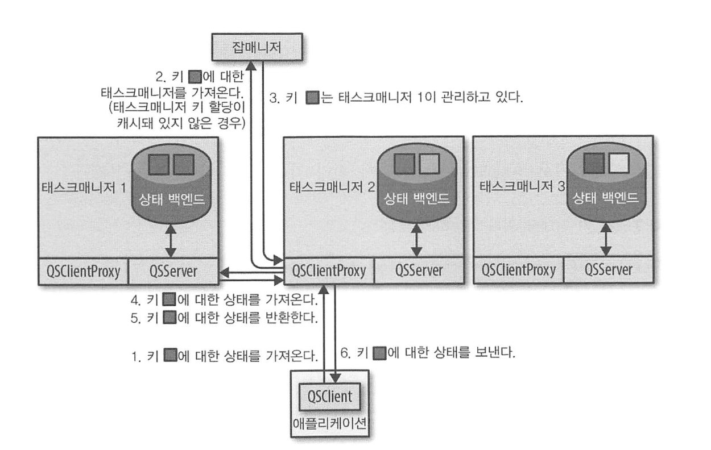

# 상태가 있는 연산자와 어플리케이션

- 스트림 어플리케이션 데이터는 긴 시간에 걸쳐 흐르므로, 복잡한 연산을 수행하는 연산자는 수신한 레코드나 중간 결과를 기억해야 한다.
- 기본 연산자, 소스, 싱크는 상태를 가지며, 레코드, 중간 결과, 메타데이터를 버퍼링한다.
- 또한 플링크 DataStream API는 사용자 정의 함수의 상태를 등록하고 유지하는 인터페이스를 제공한다.

## 상태가 있는 함수 구현

### RuntimeContext에 키 상태 선언

> 사용자 함수는 키 속성 문맥 안에서 상태를 저장, 접근할 수 있는 키 상태를 사용할 수 있다. 

플링크는 고유 키 속성마다 하나의 키 상태 인스턴스를 유지하고, 모든 키 상태 인스턴스를 함수의 여러 병렬 태스크로 분배한다. 

즉, 함수의 각 병렬 태스크가 일정 범위의 키에 대해 상태를 유지 보수할 책임을 지고 있으며, 따라서 키 상태는 분산 키-값 맵과 유사하다. 

> 키 상태는 KeyedStream에 적용하는 함수에만 사용 가능하며, KeyedStream에 적용하는 연산자는 키 속성 문맥 안에서 동작한다. <br>
> 플링크 런타임은 해당 레코드의 키와 관련된 키 상태를 넘겨주기에, 함수는 현재 처리 중인 레코드와 관련된 상태에만 접근 가능하다. 

플링크가 제공하는 기본 키 상태는 아래와 같다. 

- ValueState[T] : T 타입의 값 하나를 저장한다.
- ListState[T] : T 타입의 값 목록을 저장한다. 개별 값을 삭제할 수 없으나, 갱신할 순 있다.
- MapState[K, V] : 키-값 맵을 저장한다. 
- ReducingState[T] : addAll, update()를 제외하면 ListState와 동일
- AggregatingState[I, O] : ReducingState와 비슷하지만, 집계할 때 일반화된 AggregateFunction을 쓴다. 

상태 객체를 생성하려면 RichFunction은 RuntimeContext에 StateDescriptor을 등록해야 한다. 

StateDescriptor은 어떤 기본 상태를 사용할지 지정하고, 상태의 이름과 데이터 타입을 포함한다. 

상태 이름은 연산자 내에서만 유효하므로, 함수는 여러 StateDescriptor를 등록할 수 있고 여러 상태 객체를 가질 수 있다. 

> RichFunction의 open()에서 상태 핸들 객체를 생성한다. <br>
> 이는 상태 백엔드가 저장 관리하는 상태에 대한 접근 방법만 제공하고, 상태 자체를 갖지는 않는다.

함수가 StateDescriptor를 등록할 때 플링크는 상태 벡엔드가 이 함수의 데이터와, 지정한 이름과 데이터 타입의 상태를 가졌는지 확인한다. 

상태가 있는 함수를 장애 복구하고자 재시작하거나, 어플리케이션을 세이브포인트에서 시작할 때 해당 과정을 거친다. 

새로 등록하는 상태 핸들 객체를 기존 상태와 연결한 후, 상태 백엔드가 지정한 StateDescriptor 상태를 갖고 있지 않다면 값이 빈 상태를 상태 핸들 객체와 연결하는 식이다. 


### ListCheckpointed 인터페이스를 이용, 연산자 리스트 상태 구현

연산자의 각 병렬 인스턴스는 연산자 상태를 각각 관리한다. 

동일 병렬 인스턴스에서 처리되는 모든 레코드는 같은 상태에 접근할 수 있다. 

리스트 상태를 이용하는 함수는 ListCheckpointed 인터페이스를 구현해, 연산자 상태를 일반적인 멤버 변수로 구현하고, 콜백함수를 통해 상태 벡엔드와 상호작용해야 한다. 

```java
@PublicEvolving
public interface ListCheckpointed<T extends Serializable> {
    
    // 플링크가 상태가 있는 함수에 체크포인팅을 동작시킬 때 호출된다.
    // checkpointId : 고유하며 단조 증가하는 체크포인트 식별자
    // timestamp : 잡매니저가 체크포인트를 초기화핳ㄴ 시간
    // 반환형은 연산자 상태를 직렬화할 수 있는 리스트
	List<T> snapshotState(long checkpointId, long timestamp) throws Exception;
  
    // 잡을 시작하거나 실패가 발생해 함수 상태를 초기화해야 할 때 호출된다.
    // 상태리스트 객체를 인자로 받아 상태를 복구한다.
	void restoreState(List<T> state) throws Exception;
}

```

> 연산자 상태를 리스트로 처리하는 이유 <br>
> 리스트 상태는 함수의 병렬 값 변경을 지원한다. <br>
> 플링크는 병렬 값이 증감될 때 상태를 재분배하는 로직을 자동으로 구현하지 않지만, 리스트 상태를 이용한다면 직접 구현할 수 있다. <br>
> snaphotState()를 통해 연산자 상태를 여러 조각으로 나누고, restorestate()를 이용해 다시 재조립하는 형태다.

ListCheckpointed 인터페이스는 자바 직렬화를 이용하므로 어플리케이션을 업데이트할 때 마이그레이션을 허용하지 않아 문제가 될 수 있다. 

따라서 함수 연산자 상태의 진화 가능성이 있다면 CheckpointedFunction을 쓰는게 좋다.

### 브로드캐스트 상태 이용

스트리밍 어플리케이션은 동일 정보를 모든 함수 병렬 인스턴스로 분배하고 복구 가능한 상태로 유지해야 한다.

함수의 각 병렬 인스턴스는 연산자 상태에 모든 규칙을 보관해야 하므로, 규칙 스트림은 함수의 모든 병렬 인스턴스가 규칙을 수신할 수 있도록 브로드캐스트한다. 

함수가 브로드캐스트 상태를 이용하려면 세 단계를 거쳐야 한다.

1. DataStream.broadcast()를 호출한 후, 하나 이상의 MapStateDescriptor 객체를 제공해 BroadcastStream을 시작한다.
2. BroadcastStream을 DataStream이나 KeyedStream에 연결한다. 
   - 이 경우, 반드시 BroadcastStream을 connect()의 인자로 넘겨야 한다.
3. BroadcastStream과 연결한 스트림에 함수를 적용한다.
   - 연결한 스트림이 KeyedStream이면 KeyedBroadcastProcessFunction, 아니면 BroadcastProcessFunction을 적용한다.
   - 이때 각 함수에서 레코드를 처리하는 메서드가 대칭적이지 않으므로, 일반 CoProcessFunction과 다르다.
     - BroadcastProcessFunction의 processElement() 안에서 반환된 브로드캐스트 상태 핸들은 읽기 전용이라, 모든 병렬 인스턴스가 동일한 정보에 접근하는게 보장된다.
       - BroadcastProcessFunction은 TimerService를 제공하지 않는다.
     - KeyedBroadcastProcessFunction의 processBroadcastElement()에서 키 상태에 접근하면 안된다.
       - 브로드캐스트 입력은 키를 지정하지 않으므로 상태 백엔드가 키에 접근할 수 없기 때문이다.

> 브로드캐스트 메세지를 내보내는 연산자가 1 이상의 병렬값으로 실행 중이라면, 브로드캐스트 이벤트 순서가 비결정적일 수 있다. <br>
> 따라서 브로드캐스트 상태 값이 브로드캐스트 메세지 순서에 의존하지 않거나, 브로드캐스트하는 연산자 병렬 값을 1로 만들어야 한다.

### CheckpointedFunction 인터페이스 사용

- 키 상태나 연산자 상태를 등록하고 유지할 수 있는 훅을 제공한다.
- 리스트 유니온 상태에 접근할 수 있는 유일한 인터페이스다.
  - 리스트 유니온 상태는 장애 복구나, 세이브포인트 재시작을 대비해 상태를 완전히 복제한다.

- 상태 저장소는 함수 상태를 플링크 런타임을 이용해 등록하고, 상태 객체를 반환할 책임을 갖는다.
  - 각 상태는 이름과 함께 저장되며, 이름은 각 함수 안에서 유일해야 한다.
  - 함수가 상태를 등록할 때 상태 저장소는 해당 이름으로 등록한 함수 상태가 상태 백엔드에 있는지 검사해 상태를 초기화한다.
  - 태스크를 재시작할 때 플링크는 저장한 데이터에서 상태를 초기화한다.
  - 만약 어플리케이션이 체크포인트 or 세이브포인트에서 시작되지 않으면 상태는 빈 값으로 초기화된다.

- 플링크는 체크포인팅 수행 직전에 snapshotState()를 호출한다.
  - 인자로 받은 FunctionSnapshotContext를 통해 체크포인트 식별자와, 잡매니저가 체크포인트를 초기화한 타임스탬프에 접근할 수 있다.
  - 이 메서드는 체크포인팅 수행 전 모든 상태 객체를 최신화하는 것이다. 
  - snapshotState()를 CheckpointListener와 조합해, 플링크 체크포인팅과 동기화하면서 외부 데이터 저장소에 일관성 있는 데이터 쓰기도 가능하다.

### 체크포인팅 완료 알림 받기

- 잦은 동기화는 분산 시스템 성능 저하의 원인이므로, 플링크 체크포인트 설계 목표는 동기화 지점을 줄이는 것이다. 
  - 플링크 체크포인트는 데이터와 함께 흘러다니는 배리어를 기반으로, 어플리케이션 전체에 걸친 전역 동기화를 피해 높은 성능을 낸다.
  - 단, 이로 인해, 체크포인팅을 수행하는 논리적 시점을 제외, 어플리케이션의 전체 상태가 절대 일치하지 않게 된다.
- 오로지 잡매니저만 체크포인팅의 성공 여부를 판단할 수 있다.
  - 모든 연산자 태스크가 자신의 상태를 성공적으로 체크포인팅 했을 때만 체크포인팅에 성공한 것으로 판단하기 때문이다.
- 체크포인팅 완료를 알림으로 받고 싶다면, 연산자에서 CheckpointListener 인터페이스를 구현하면 된다.

```java
@PublicEvolving
public interface CheckpointListener {

	// 잡매니저가 체크포인팅이 완료된 것으로 등록할 때 호출된다.
    // 단, 플링크는 각 체크포인팅 완료마다 이 메서드가 호출될 것을 보장하지 않으므로, 태스크가 체크포인팅 완료 알림을 놓칠 수 있음을 고려해야 한다.
	void notifyCheckpointComplete(long checkpointId) throws Exception;
}

```

---

## 상태가 있는 어플리케이션의 장애 복구 활성화

- 체크포인트는 스냅샷을 의미한다.
  - 모든 연산자가 어플리케이션 입력 스트림의 특정 지점까지 이벤트를 처리하고, 해당 시점까지 발생한 모든 함수 상태를 기록한다.
- 잡매니저는 일정 주기로 체크포인팅을 수행해, 어플리케이션에 장애 극복을 제공한다.
- 체크포인팅 주기가 짧아질 수록 데이터 처리 오버헤드가 높아진다.
  - 대신 더 적은 데이터를 재처리하면 되므로 어플리케이션 복구는 더 빨라질 것이다.  

---

## 상태가 있는 어플리케이션의 유지 보수 활성화

오랜 시간 동작한 어플리케이션 상태는 복구할 때 많은 비용이 필요하거나, 유지보수가 어려울 수 있다. 

따라서 어플리케이션 상태를 새 버전으로 마이그레이션하거나, 병렬 값을 변경해, 새 연산자 태스크로 부하와 상태를 재분배해야 한다. 

플링크는 어플리케이션과 상태를 유지보수하는 세이브포인트 기능을 제공한다. 

어플리케이셔이 잘 유지보수되게 하려면, 어플리케이션을 처음 만들 때부터 모든 상태가 있는 연산자에 아래 파라미터를 지정해야 한다. 

- 고유한 연산자 식별자
- 키 상태 연산자에 대한 최대 병렬 값 

> 한 번 연산자의 고유 식별자와 최대 병렬 값을 세이브포인트에 저장하면, 이 파라미터들은 변경이 불가능하다. <br>
> 변경하려면 세이브포인트에서 어플리케이션을 시작할 수 없고, 아예 완전히 재시작해야 한다. 

### 연산자 고유 식별자 지정

- 어플리케이션 모든 연산자마다 고유 식별자를 지정할 것을 권장한다. 
  - 연산자 식별자도 메타 데이터로 세이브포인트에 저장된다.
  - 따라서, 어플리케이션을 세이브포인트에서 시작할 때, SP 상태를 APP 연산자와 연관시킬 때 연산자 식별자를 쓴다.

```java
KeyedSensorData
    .flatMap()
    .uid("TempAlert");  // 고유 식별자 설정
```

### 키 상태 연산자에 최대 병렬 값 정의

- 연산자의 최대 병렬 값 파라미터 : 연산자의 모든 키 상태를 몇 개의 키 그룹으로 나눌지를 정의한다.
  - 키 그룹 개수 : 키 상태를 갖고 있는 연산자의 최대 확장 가능한 병렬 태스크 수를 제한한다. 
- StreamExecutionEnvironment를 이용해 어플리케이션 모든 연산자에 대해 설정하거나,
- 각 연산자의 setMaxParallelism()으로 설정한다.
- 연산자의 기본 최대 병렬 값은 오기 어플리케이션의 연산자 병렬 값에 의존한다.
  - 병렬 값이 128 이하라면 최대 병렬 값은 128
  - 그보다 크다면, 최대 병렬 값을 `Min(2^15, nextPowerOfTwo(parallelism + (parallelism / 2)))`로 설정한다

---

## 상태가 있는 어플리케이션의 성능과 견고함

어플리케이션 실행의 견고함과 성능의 일관성은 연산자와 상태가 상호작용하는 방식에 영향을 준다. 

아래는 견고함과 일관성을 보장하기 위해 고려해야 할 점들이다. 

### 상태 백엔드 선택

플링크는 어플리케이션 상태를 상태 백엔드에 저장한다. 

따라서 상태 백엔드는 각 태스크 인스턴스의 로컬 상태 저장과 체크포인팅 수행 시, 로컬 상태를 원격 저장소에 영구 저장할 책임을 갖는다. 

플링크가 제공하는 상태 벡엔드는 총 세가지다.

1. MemoryStateBackend : 상태를 태스크매니저 프로세스의 힙에 일반 객체로 저장한다. 
    - 상태 읽기 쓰기 지연이 매우 낮아 성능은 좋으나, 어플리케이션 견고함이 떨어진다.
    - 태스크 인스턴스 상태가 너무 커지면 OOM으로 죽을거고, GC가 돌 때 JVM이 멈춰 태스크 매니저가 힘들어진다.
    - 또한 메모리는 휘발성이므로, 잡매니저에 장애 발생 시 모든 상태가 사라질 것이다.
2. FsStateBackend : 로컬 상태를 태스크매니저 JVM 힙에 저장하지만, 상태 체크포인트를 원격의 영구 파일 시스템에 저장한다. 
    - 로컬에서는 인메모리 수준의 성능을 내며, 장애 극복도 가능하다.
    - 단 GC STW로 영향을 받을 수 있다.
3. RocksDBStateBackend : 모든 상태를 로컬의 RocksDB 인스턴스에 저장한다.
    - RocksDB : 임베디드 K-V 저장소. 데이터를 로컬 디스크에 영구 저장한다. 
    - 데이터를 읽고 쓸 때 데이터 직렬화/역직렬화가 필요해 읽기 쓰기 성능이 떨어진다.
   
StateBackend는 공개 인터페이스이므로, 사용자 정의 상태 백엔드도 구현할 수 있다. 

### 기본 상태 종류 선택

RocksDBStateBackend처럼 상태 객체를 읽고 쓸 때 데이터 직렬화/역직렬화가 필요할 경우, 기본 상태 선택이 성능에 영향을 미친다. 

예를 들어, RocksDB를 쓸 때, MapState가 ValueState보다 효율적이며, 리스트 읽기보다 쓰기가 잦을 땐 ListState가 효율적이다. 

또한, 체크포인팅과 함수 호출이 동기화되기 때문에, 함수 호출 당 한 번만 상태를 갱신하게 하는 것이 어플리케이션 성능을 높이는데 도움이 된다. 

### 상태 누수 방지

보통 스트리밍 어플리케이션은 오랜 기간 동안 실행되도록 설계되므로, 규모를 확장하지 않는 한, 어느 순간 상태 크기가 너무 커져 어플리케이션이 죽을 것이다. 

따라서, 시간이 지남에 따라, 연산자 상태 크기를 통제할 수 있도록 만들어야 한다. 

- 플링크는 자동 상태 정리 및 저장소 정리 기능을 제공하지 않는다.
  - 따라서 상태가 있는 연산자는 자신의 상태 크기를 제어하고, 이 연산자 크기가 무한으로 증가하지 않게 보장해야 한다. 
- 일반적으로 상태가 커지는 원인
  - 계속 진화하는 키 도메인의 키 상태
    - 즉, 함수가 특정 기간에만 나타나는 키의 레코드를 수신하다, 이후 해당 키를 포함하는 레코드를 더 이상 수신하지 않는 경우.
    - 예를 들면 클릭 이벤트. 일정 세션이 만료된 이후에도 계속 세션 키 상태를 누적시키는 케이스.
    - 만료된 키 상태를 제거하는게 제일 좋지만, 어떤 레코드가 마지막 레코드인지 알 수 없으므로 이는 불가능하다.
  - 개수 기반 트리거를 사용하는 윈도우에서도 비슷한 문제가 발생한다. 

상태가 있는 연산자를 설계하고 구현할 때, 어플리케이션 요구사항과 키 도메인 같은 입력 데이터 속성을 고려해야 할 것이다. 

계속 변하는 키 도메인에 대해 키 상태가 필요하다면, 미래에 어느 시점에 동작할 타이머를 등록해두자. 

---

## 상태가 있는 어플리케이션의 진화

장시간 실행되는 어플리케이션의 버그 수정이나 로직 변경은 필연적이므로, 상태 유실 없이 새 버전으로 교체할 필요가 있다. 

플링크는 세이브포인트를 이용해 이런 업데이트를 지원한다.

어플리케이션을 세이브포인트에서 시작할 때, 연산자는 연산자 식별자와 상태 이름을 이용해 세이브포인트에서 상태를 찾아온다. 

세이브포인트 호환 관점에서 아래 세 가지 방식의 어플리케이션 업데이트가 가능하다. 

### 기존 상태 수정 없이 어플리케이션 갱신

기존 상태를 변경하거나 삭제할 필요 없이 로직을 갱신하거나 확장한다면, 세이브포인트는 항상 호환되고, 이전 버전의 세이브포인트에서 시작할 수 있다. 

상태가 있는 연산자를 추가하거나, 새 상태를 기존 연산자에 추가한다면, 세이브포인트에서 재시작될 때 해당 상태는 빈 값으로 초기화 된다. 

> 상태가 있는 연산자의 입력 데이터 타입 변경은 내부 상태 종류를 변경할 수 있으므로, 세이브포인트와 호환되지 않는다. 

### 어플리케이션에서 상태 제거

어플리케이션에서 상태가 있는 연산자를 완전히 삭제하거나, 함수에서 상태만 제거하고 싶을 수 있다. 

세이브포인트에서 재시작하면, 새로운 어플리케이션과 관련 없는 상태까지 유지된다. 

모든 상태를 복원하지 않는 어플리케이션은 시작하지 않는 안전 검사 설정을 해제하여 쉽게 상태를 제거할 수 있다. 

### 연산자의 상태 변경

상태를 변경하는 두 가지 방법이 있다. 

1. ValueState[Int] -> ValueState[Double] 와 같이, 상태 데이터 타입을 변경
2. ValueState[List[String]] -> ListState[String]와 같이, 상태 기본 타입을 변경.

데이터 타입 변경은 일부 특정한 경우 가능하나, 기본 타입 변경은 불가능하다. 

- 상태 데이터 타입 변경
  - 세이브포인트는 직렬화한 상태 데이터를 가지고 잇으므로, 데이터 타입이 변경되면 시리얼라이저도 변경되어야 한다. 
  - 플링크 1.7 기준, 새 데이터 타입이 아브로 스키마 진화 규칙에 따라 원래 타입에서 진화한 아브로 타입일 때만 지원된다. 

---

## 쿼리 가능한 상태

스트림 처리 어플리케이션이 결과를 다른 어플리케이션과 공유하기 위해, DB나 K-V store에 결과를 써야 한다. 

플링크는 쿼리 가능한 상태를 지원하므로, 마치 플링크를 K-V store처럼 사용할 수 있다. 

어플리케이션이 재시작되거나, 수평 확장, 마이그레이션 되는 동안에는 접근이 불가능하지만, 실시간 대시보드나 모니터링은 쉽게 구현할 수 있다. 

### 쿼리 가능한 상태의 아키텍처와 쿼리 가능한 상태 활성화

쿼리 가능한 상태 서비스를 이용하려면 세 단계를 거쳐야 한다.

1. 외부 어플리케이션은 QueryableStateClient를 통해 쿼리를 보내고 결과를 받는다. 
2. QueryableStateClientProxy를 이용해 클라이언트 요청을 받아 서비스를 제공한다. 
   - 키 상태가 모든 연산자 인스턴스에 흩어져있으므로, 요청한 키 상태를 어떤 태스크매니저가 관리 중인지 식별해야 한다. 
   - 이 정보는 키 그룹 할당을 관리하는 잡매니저에서 요청하며, 한 번 받은 정보는 메모리에 캐시한다. 
3. QueryableStateServer는 QueryableStateClientProxy의 요청을 처리한다. 



### 쿼리 가능한 상태 노출

- StateDescriptor에 setQueryable을 이용해, 외부 식별자를 설정하고 쿼리 가능한 상태로 만들면 된다. 
- 또한 asQueryableState()를 이용해 쿼리 가능한 상태를 스트림 싱크로 추가할 수 있다. 

### 외부 어플리케이션에서 상태 쿼리

- flink-queryable-state-client-java 모듈을 이용, JVM 기반의 어플리케이션은 실행 중인 플링크 어플리케이션의 쿼리 가능한 상태를 쿼리할 수 있다. 
- 클라이언트는 여러 쿼리를 비동기적으로 보내고 결과를 기다릴 수 있다. 
- 어플리케이션이 실행되면, 먼저 로그나 웹 UI에서 JobID를 찾는다. 이후엔 상태를 쿼리한다.